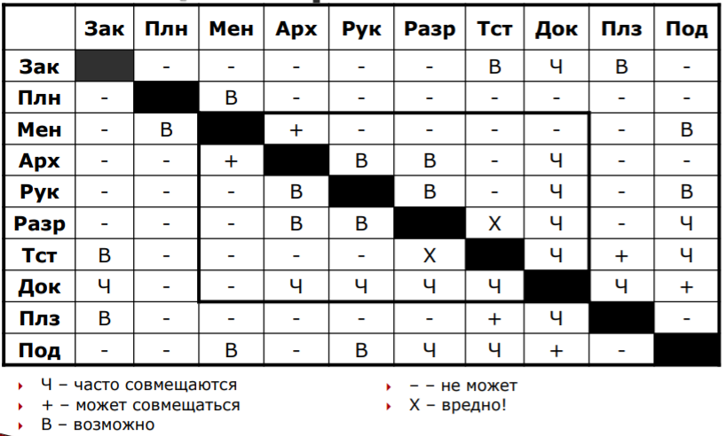
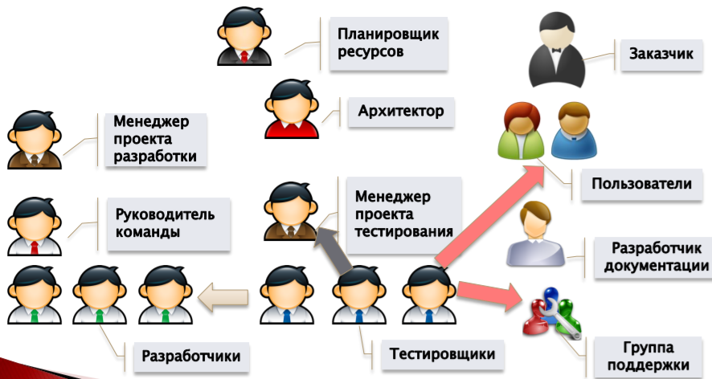
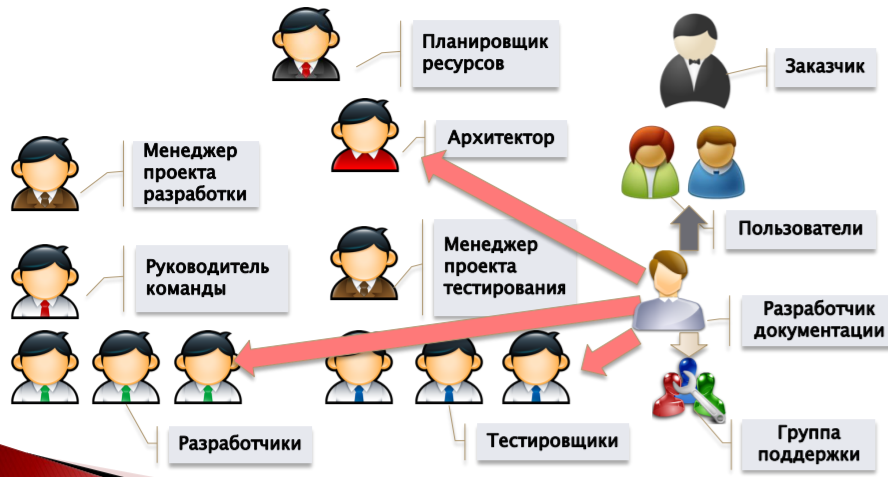

# 8. Стратегии конструирования ПО. Экстремальное программирование

Экстремальное программирование (extreme programming, XP) ориентировано на группы до 10 человек.

Вся группа обязательно находится в одном помещении.

Процесс:

- гибкий
- динамичный
- итеративный
- может быть изменяющимся - XP наиболее для этого подходит

Основные "занятия":

- написание кода
- тестирование
- получение требований/изменений от заказчика
- проектирование

Приспособление к изменениям (динамика) из-за:

- постоянной связи с заказчиком
- выбора простейшего решения
- быстрой обратной связи
- профилактики проблем

Основные практики XP:

- игра в планирование
  - от заказчика получаем объём работ, временные требования и сроки выпуска
  - от разработчиков - временные оценки, последствия и ход работы
- небольшие версии
  - выпуск маленьких и простых версий
  - версия обязательно должна быть завершённой
  - примерно 1 версия в 14 дней
- метафора
  - видение проекта с примерными требованиями архитектуры
  - сведения об архитектуре
- простой дизайн
  - проходят все тесты
  - отсутствует дублирующая логика
  - минимальное число классов/методов
  - новое добавляется только тогда, когда оно нужно
- тестирование
  - юнит-тесты для всего кода от разработчиков
  - функциональное тестирование от заказчика
  - код разрабатывается вместе с тестами или после них
- рефакторинг
  - изменение программы без фактического изменения функциональности
  - для упрощения добавления нового функционала
- парное программирование (!!!)
  - разработчики работают парами
  - тот, кто пишет код, думает над конкретной реализацией
  - тот, кто рядом, думает стратегически
  - состав пар меняется
- коллективное владение
  - код - общий, мгновенно изменяется при необходимости
- непрерывная интеграция
  - интеграция кода - постоянная, не реже одного раза в день
  - кончается после прохождения всех тестов
  - ответственные - те, кто внесли изменения
- 40ч рабочая неделя
  - переработки нежелательны, свидетельствуют о неправильной организации работы
  - отпуск обязателен
- локальный заказчик (!!!)
  - вместе с разработчиками обязательно присутствует представитель заказчика - тот, кто будет пользоваться продуктом
  - отвечает на возникающие у разработчиков вопросы
  - наличие представителя - способ наискорейшей коммуникации

# 9. Стратегии конструирования ПО. Методология SCRUM

SCRUM изначально появился в компании Toyota. Подход оказался хорошо масштабируемым и переносимым на разработку ПО.

SCRUM:

- гибкий
- итерационный
- адаптируемый под многие процессы
- масштабируемый, что важно для гибких подходов
- применим к любым этапам/особенностям разработки ПО
- хорошо стыкуется с использованием ООП-подхода

Планирование реализуется с помощью спринтов:

- каждые 7/14/30 дней, не больше 30 дней
- реализует часть функциональности

Встречи разработчиков:

- до начала каждого спринта - sprint planning meeting
- ежедневно - тот самый scrum ("схватка с англ.")
- после конца спринта - спринт-ревью с демонстрацией результатов

Генерируемые артефакты:

- backlog 
  - список целей/задач, необходимых для реализации всего проекта
  - "журнал пожеланий проекта"
- sprint backlog
  - список целей/задач, необходимых для реализации спринта
  - "журнал пожеланий спринта"
- burndown chart (диаграмма сгорания задач)
  - показывает идеальный темп выполнения задач, текущее положение дел и "температуру" проекта
- scrum board
  - минимальный размер - 3 столбца: TODO, in progress и done
  - строки - либо зоны ответственности разработчиков, либо типы задач

Роли участников:

- основные
  - product owner
  - scrum master
  - scrum team
- остальные
  - пользователи
  - эксперты-консультанты

Ход работы (относительно выполнения задач):

- формируется product backlog (все изменения - только сюда)
- его небольшой кусочек выносится в sprint backlog (заморожен ДО КОНЦА СПРИНТА)
- команда независимо работает над своим спринтом
- на выходе - готовый кусок функционала

Ход работы (относительно зон ответственности):

- заказчик определяет функциональные требования, периодически их меняет
- владелец продукта расставляет приоритеты
- формируются группы (обычно 1-6, реже вплоть до 9) для выполнения отдельных частей проекта
- формируется project backlog
- формируется sprint backlog для каждой группы
- выполняются спринты (автономно)

На каждой scrum-встрече каждый из команды:

- рассказывает, что сделал за предыдущий день
- рассказывает, что сделает за сегодняшний
- рассказывает, что мешало работе (scrum master пытается разрешить эти проблемы)

SCRUM эффективен без каких-либо менеджеров из-за:

- ежедневных встреч для "синхронизации" работы
- небольших групп

SCRUM часто объединяется с прочими методологиями, сейчас почти отсутствует в чистом виде.

# 22. Роли участников в программных проектах

Роль - конкретное амплуа сотрудника в конкретном проекте в определенное время. 
В программных проектах обычно оперируют ролями, а не сотрудниками.

Состав, назначение и функциональные обязанности ролей зависят от конкретного процесса разработки в компании. 
В принципе возможно совмещение разных ролей в разных проектах.

## Роли в процессе разработки программных проектов:

- Основные:
  - __заказчик__ (customer)
  - __планировщик ресурсов__ (planner)
  - __менеджер проекта__ (project manager)
  - __архитектор__ (architect)
  - __руководитель команды__ (team leader, team lead)
  - __разработчик__ (developer)
  - __тестер__ (tester, QA)
  - __разработчик документации__ (technical writer)
  - __пользователь__ (user)
  - __инженер группы поддержки__ (support engineer)

- Дополнительные:
  - __эксперт предметной области__
  - __специалист по пользовательскому интерфейсу и эргономике__
  - __ответственный за выпуск релизов__
  - и т.д.

## Конкретнее о некоторых ролях:

### Заказчик:

- Инициирует разработку
- Участвует в сборе требований
- Участвуете в разработке спецификаций требований
- Принимает результаты разработки

### Планировщик ресурсов:

- Член руководства организации 
- Выдвигает и координирует требования к проектам в организации
- Развивает и направляет план выполнения проекта с точки зрения организации
- Обеспечивает финансирование проекта

### Менеджер проекта:

- Внешние функции:
  - взаимодействия с _заказчиком_ и _планировщиком ресурсов_
- Внутренние функции:
  - Распределяет задачи среди членов команды
  - Организует выполнение проекта
  - Контролирует процесс разработки

### Архитектор:

- Проектирует архитектуру системы
- Разрабатывает основные проектные решения
- Определяет общий план развития проекта
- Определяет инфраструктуру разработки

### Руководитель команды:

- Является "главным разработчиком"
- Осуществляет техническое руководство командой
- Разрешает технические вопросы

### Разработчик:

- Реализует проектируемые компоненты
- Создает классы и методы
- Осуществляет кодирование
- Разрабатывает модульные тесты
- Выполняет автономное тестирование
- Внутри команды может иметь специализацию

### Тестировщик:

- Проверяет качество программного обеспечения (функциональность, надежность, эффективность и т.д.). 
  Составляет тесты для каждой фазы проектирования продукта.
- Исполняет созданные тесты
- Выполняет функциональное тестирование 
- Выполняет интеграционное, системное тестирование

### Разработчик документации: 

- Разработка программной документации
- Разработка эксплуатационной документ
- Ведение информационной поддержки процесса разработки

### Пользователь:

- Не является заказчиком проекта
- Может являться, а может и не являться сотрудником проекта
- Является главным потребителем проекта
- Обычно существуют группы пользователей проекта

### Эксперт предметной области: 

- Обеспечивает информационную поддержку в предметной области проекта
- Может быть несколько экспертов, если проект большой

### Специалист по пользовательскому интерфейсу и эргономике:

- Проектирует пользовательские интерфейсы
- Взаимодействует с заказчиком
- Анализирует и оценивает комплексные характеристики интерфейса:
  - Удобство
  - Эргономичность
  - Лаконичность 
  - Дружественность
  - Локализуемость
  - ...

### Ответственный за выпуск релиза:

- Определяет и реализует политику выпуска релизов
- Формирует и проверяет требования к конкретному релизу:
  - Необходимая функциональность
  - Состав релиза
- Определяет дату выхода релиза
- Контролирует процесс выхода релиза

### Библиотекарь:

- Ведет библиотеку проекта
- Контролирует соответствие выпускаемого продукта принятым стандартам

## Совмещение ролей

# 23. Взаимодействие между ролями в программных проектах

## Связи для планировщика ресурсов

## Связи для менеджера проекта

## Связи для архитектора

## Связи для руководителя команды

## Связи для разработчика

## Связи для тестировщика

## Связи для разработчика документации

## Связи для пользователя

## Связи для заказчика

# 33. Предпосылки для версионирования ПО. Ветвление.

## Предпосылки.

### Необходимость групповой работы.

Основные задачи: 

* Повышение надежности хранения артефактов.
* Общий доступ к артефактам.
* Сохранение истории модификации артефакта.
* Возможность возврата к предыдущим версиям.
* Пометка отдельных версий файла.
* Поддержание и развитие нескольких.
  параллельных историй артефакта.
* Поддержка нескольких конфигураций проекта.
* Сравнение версий.
* Объединение разрозненного кода.

### Необходимость общего доступа к артефактам.

* Одновременное редактирование одного
  артефакта разными пользователями.
* Потеря изменений, сделанных
  пользователем (затерты записью
  изменений другого пользователя).

** В параллельных системах для разрешения
используются семафоры, мьютексы, критические
секции и т.п.

### Необходимость сохранения истории модификации артефакта.

Нужно хранить:

* Версию.
* Автор изменения.
* Время изменения.
* Суть изменения.
* Причина изменения.
* И т.п.

### Необходимость пометки отдельных версий артефакта.

Хотим оставить тэги/нотации, на конкретные артефакты в истории, это может быть 
необходимо по следующим причинам:

* Качественная версия, т.е например исправили большое число ошибок и хотим зафиксировать ситуацию
* Версия обладает определёнными свойствами, например версия стала работать под сиситемой андроид, или
  появился раздел помощи и т.п.
* Версия, являющаяся частью релиза проекта определенной версии. Например альфа версия, бета 
  версия и т.п. Почему не самая последняя версия? - Необходимо уметь восстановиться в случае 
  если в последующих версиях была регрессия, и могли воспроизвести и исправить ошибки 
  определённой версии.

### Необходимость поддержки и развития нескольких историй артефакта.

Зачем нужно ветвить версии файла:

* Одновременное развитие нескольких версий проекта, например по причине изменения требований.
  Например необходимы следующие версии:
    * Поставляемые заказчику.
    * Разрабатываемые.
* Разработка новой функциональности, которая ведётся в отдельной ветке, чтобы в будущем слить 
  изменения, либо если эксперимент оказался неудачный, не навредить основной функциональности.

### Необходимость поддержки нескольких конфигураций проекта.

*  Наличие нескольких конфигураций проекта для:
   * разной аппаратуры.
   * разного системного програмного обеспечения.
   * разных комплектов поставки. Например распространяем продукт за деньги, но есть 
     бесплатная версия с ограниченным функционалом.
*  Разработка новой (экспериментальной) функциональности.

## Ветвление

* Ветвь (ветка, branch) – механизм, который служит для ветвления дерева ревизий файла.
* Имя ветви однозначно определяет группу ревизий (ветвь).
* Имя ветви используется для переключения между ветвями ревизий файла.

# 34. Системы контроля версий. Типы СКВ. Общие принципы организации. 

Другие названия системы контроля версий:

* Системы управления версиями (VCS - Version
  Control System).
* Системы контроля ревизий (RCS - Revision
  Control System).
* Системы управления исходным кодом (SCM –
  Source Code Management).

Системы контроля версий - это специализированные програмные инструменты , которые решают задачу
автоматизации групповой работы и управления версионированием проектов.
Изначально только для программных проектов.Но сейчас используются почти во всех областях, где есть 
атрефакты, сохраняемые в виде файлов операционной системы и над которыми можно работать. Например 
проекты по управлению созданием аппаратуры; написание документации, статей, книг и т.д. 
Везде где есть артефакты, файлы, которые могут версионироваться, отмечаться, удаляться, 
сравниваться и т.д.

## Общие принципы систем контроля версий

Системы контроля версий обеспечивают:

* Репозиторий (или несколько репозиториев) для хранения проектов и их артефактов. 
* Стандартизируют стандартные операции для групповой работы.Т.е вводят операции, необходимые 
  для групповой работы. Обычно таких операций 30-40 в каждой системе контроля версий.
* Предоставляют клиенты для разных операционных систем для выполнения операций. 
  Почти всегда есть текстовый(консольный) клиент для выполнения этих операций. 
  Консольный клиент необходим для автоматизации:
    * автоматизация сборки.
    * continuous integration.
    * continuous delivery.
    * и т.д.

Значит что эти операции выполняются не человеком, а роботом. Соответственно есть два подхода:

* сделать публичный API, которым будет пользоваться система автоматизации.
* использовать консольные приложения с публичным API - аргументы командной строки.

Почему используют командную строку, а не другой публичный API? Так как в случае использования API, 
пришлось бы сделать для всех возможных систем реализацию. В случае с командной строкой, при появлении
новой системы, просто изменяются конфигурационные файлы - названия команд и параметров, которые они принимаю, 
интерпретации вывода. Не придётся дописывать модуль интеграции или что то вроде этого.

Это является стандартом, когда интеграция с разными системами автоматизации может производиться 
через командную строку. В случае работы с API, такого же простого механизма нет.

## Типы систем контроля версий

Условно делят на два типа, у одного из которых есть два подтипа:

* централизованные файл-серверные системы контроля версий. Самые древние. 
  Организованы следующим образом:
    * имеется централизованное хранилище на сервере. 
    * Клиенты обращаются к хранилищу используя файл-серверный доступ. Файл-серверный доступ - 
      когда организуем взаимодействие двух приложений через разделяемые файлы, разделяемые файлы.
        Репозиторий, в котором хранятся проекты использыется как разделяемый ресурс, а клиенты через 
        средства операционной системы по управлению общими файлами доступаются к репозиторию.
        Например: MS Visual Source Safe. Единственные способ работы над файлом - его блокировка.
* Централизованные системы контроля версий. Организованы следующим образом:
  * имеется единое централизованное хранилище на сервере.
  * клиент-серверный доступ. Клиенты у пользователей, по специальному протоколу обращаются к серверу
    , где расположен репозиторий и операции осуществляются через серверное ПО и через клиентов.
    Например: CVS, Subversion.
* Распределённые системы контроля версий:
  * есть множество репозиториев. Есть центральный репозиторий + каждый компьютер является маленьким 
    репозиторием.
  * обмен информацией между отдельными репозиториями реализуется через специальные механизмы слияний
    (заплаток, патчей, change sets и т.п).
  * Используется в интернет-проектах, когда разработчики существенно удалены друг от друга.
    Например: mercurial, git, Bazaar и т.п.

Файл-серверные системы практически не встретить. Централизованные системы постепенно отдают 
пространство распределённым. 

Пример, когда нельзя работать в централизованной системе - система идеальна только при условии
, что у всех участников проекта есть интернет. Однако существует множество мест, где интернета нет, 
либо доступ периодами, либо слишком плохой. Ответ: когда необходми продолжать вести разработку 
в местах где нет интернета.

Минусы распределённой системы контроля версий:

* много сущностей - больше репозиториев.
* большое количество ежедневных операций, по сравнению с централизованной системой контроля версий.

Относительное преимущество централизованной системы контроля версий - всегда есть репозиторий, в котором есть 
последняя версия проекта. В распределённых системах у каждого рарзаботчика может быть разная версия проекта, в зависимости 
от того успел разработчик слить изменения или нет, сложно точно определить где последняя версия.

### Ревизия файла

Все файлы и артефакты, которые хранятся в системе контроля версий имеют уникальный идентификатор - 
ревизия файла. Примеры:

* CVS: 1.2.
* SVN: 238.
* Git, Mercurial: хэш SHA-1.

При любом изменении файла изменяется также и номер ревизии файла, по определённому правилу: 
например в системе SVN инкрементируется, в системе CVS инкрементируется последня значащая цифра
, когда требуется ревизия всего репозитория, то изменяется атрибут всего репозитория. 

У ревизий есть разные атрибуты: 

* идентификатор.
* автор, кто сделал данную ревизию.
* дата.
* текстовое описание, почему эта ревизия появилась
* внешние атрибуты:
  * тэги 
  * идентификаторы ветвей

Для централизованных систем контроля версий может быть несколько состояний в которых находится проект:

* локальная копия проекта, которая ещё не влита в репозиторий.
* локальная копия проекта, но под системой контроля версий, в таком случае добавляются скрытые файлы с 
  мета информацией.
* серверная копия репозитория

Для распределённых систем контроля версий существуют следующие состояния: 

* локальная копия проекта.
* локальная копия проекта, под контролем системы контроля версий.
* копия находящаяся в локальном репозитории.
* копия находящаяся в удалённом репозитории.

### Общие принципы храненм файлов в системах версионирования.

* Поддержка текстового и бинарного формата. Текстовый формат чаще всего нужен для 
  представления исходного кода артефактов. В текстовом формате реализуются слежующие функции:

    * хранение инкрементальных изменений. Хранится первая версия и "дельты" относительно первой версии.
    * возможность визуального сравнения ревизий

     Для бинарного формата следующие функции:

    * хранение полных версий артефакта. Например полная версия картинки, документации.
    * функции сравнения не предусмотрено.

    Хранение бинарных версий артефакта необходимо делать только в случае острой необходимости.

* Пометка версий в системе контроля версий, используются следующие способы пометки:

  * тэги
  * именованные виртуальные каталоги 

  Пометка тэгами - специализированными текстовыми метками, которые привязываются к какой либо 
  ревизии файла или репозитория. Для тэга важно быть неизменяемым для гарантии целостности.

  * одна ревизия может содержать несколько тэгов.
  * Выборку ревизии файла/файлов можно производить по тэгам.

  Именованные виртуальные каталоги:

  * Вместо тэга создается каталог.
  * В него помещаются виртуальные копии необходимых ревизий всех требуемых файлов
  * Работа с таким каталогом происходит стандартными способами
  * необходимо гарантировать неизменяемость файлов внутри каталога

# 35. Системы контроля версий. Типовые операции.

* Импорт проекта (import).
* Экспорт проекта (export).
* Получение проекта (checkout, clone, …).
* Обновление файла (update, fetch, ..).
* Фиксация изменений (commit).
* Сравнение изменений.
* Установка тэгов.
* Переход к другой ревизии (откат).
* Создание ветвей (fork,…).
* Переключение на ветвь.
* Слияние (merge).
* Разрешение конфликтов.
* Блокировка файлов.
* Выгрузка изменений (push).
* Запрос на изменение (pull request).

Импорт - первоначальное помещение локального проекта в репозиторий .

Экспорт - редкая операция, окончание разработки проекта, состоит из двух шагов:

* Извлечение проекта из системы контроля версий в локальный каталог.
* Удаление проекта из системы контроля версий.

Получение копии проекта: 

* Получение локального слепка проекта
* Получение осуществляется по одному из критериев:
  * Головная версия (HEAD, trunk, default, master, …).
  * Версия на определенную дату.
  * Версия с определенным тэгом.
  * Версия из определенной ветви.

Фиксация изменений:

* Посылка измененной версии файла в репозиторий
* Операция игнорируется, если ревизия на сервере изменилась

Обновление файлов:

* Копирование свежей версии из репозитория
* Слияние локальных изменений и серверных в локальном файле

Разрешение конфликтов
Конфликт - изменений одной и той же строки в двух версиях.

* Если при слиянии произошел конфликт – в текст попадают обе версии участков кода с пометками.
* Разрешение проводится только в локальной копии.
* В репозитории хранятся только утвержденные версии с разрешенным конфликтом.

Сравнение изменений:

* Действует только для текстовых файлов.
* Сравнивать можно любые две ревизии одного файла из любых ветвей проекта.