# 1. Жизненный цикл ПО. Классификация стратегий конструирования ПО.

### Жизненный цикл программного обеспечения

 Это ряд событий, происходящих с системой в процессе ее создания и дальнейшего использования. Говоря другими словами, это время от начального момента создания какого либо программного продукта, до конца его разработки и внедрения. Жизненный цикл программного обеспечения можно представить в виде моделей. 

#### Основными этапами жизненного цикла программного обеспечения являются: 

- определение требований и разработка спецификаций – анализ и планирование; 
- проектирование; 
- разработка; 
- тестирование; 
- документирование; 
- внедрение и сопровождение.

 В зависимости от того, в каком порядке и с какой частотой выполняются эти этапы, выделяют различные методологии проектирования ПО. 

#### Планирование 

Определение стратегии предполагает исследование системы. Основная задача обследования — это оценка реального объема проекта, его целей и задач, а также получение определений сущностей и функций на высоком уровне. Итогом этапа определения стратегии становится документ, где четко сформулировано следующее: что именно причитается заказчику, если он согласится финансировать проект; когда он сможет получить готовый продукт (график выполнения работ); во сколько это ему обойдется (график финансирования этапов работ для крупных проектов). В документе должны быть отражены не только затраты, но и выгода, например время окупаемости проекта, ожидаемый экономический эффект (если его удается оценить). Следует выделить набор фактов, которые должны быть обязательно отражены в заключительном документе после проведения обследования и анализа деятельности предприятия: 

- ограничения, риски, критические факторы, влияющие на проект; 
- совокупность условий эксплуатации будущей системы: архитектура, аппаратные и программные ресурсы, внешние условия ее функционирования; состав исполнителей и работ, обеспечивающих функционирование системы; 
- критические сроки завершения этапов, форма сдачи работ, защита коммерческой информации; 
- описание выполняемых системой функций; 
- интерфейсы и распределение функций между человеком и системой; 
- требования к программным и информационным компонентам ПО; 
- наличие потенциального развития системы в будущем; 
- то, что не будет реализовано в рамках проекта. 

#### Проектирование 

Состоит в создании: 

- архитектуры программного обеспечения; 
- модульной структуры программного обеспечения; 
- алгоритмической структуры программного обеспечения; 
- структуры данных; 
- входного/выходного интерфейса (входных/выходных форм данных). 

При решении задач проектирования основное внимание уделяется качеству будущего программного продукта. 

#### Кодирование или разработка 

Состоит в переводе результатов проектирования в код программы на ранее определенном языке программирования. 

#### Тестирование 

Группы тестирования могут привлекаться к сотрудничеству уже на ранних стадиях разработки проекта. Чем сложнее проект, тем больше будет потребность в автоматизации системы хранения ошибок — bug tracking, которая обеспечивает следующие функции: 

- хранение сообщения об ошибке (к какому компоненту системы относится ошибка, кто ее нашел, как ее воспроизвести, кто отвечает за ее исправление, когда она должна быть исправлена); 
- система уведомления о появлении новых ошибок, об изменении статуса известных в системе ошибок (уведомления по электронной почте); 
- отчеты об актуальных ошибках по компонентам системы; 
- информация об ошибке и ее история; 
- правила доступа к ошибкам тех или иных категорий; 
- интерфейс ограниченного доступа к системе bug tracking для конечного пользователя. 

Подобные системы берут на себя множество организационных проблем, в частности вопросы автоматического уведомления об ошибках. 

#### Документирование

 На данном этапе происходит финальная подготовка, проверка, передача готового пакета технической документации заказчику и дальнейшее использование готового проектного образца. Разработчики подготавливают и предоставляют готовую документацию для дальнейшего изучения и практического использования. Документирование также присутствует на этапах анализа планирования и проектирования продукта, для того, чтобы зафиксировать цели, задачи и решение по проекту. 

#### Внедрение и сопровождение

**Сопровождение** – процесс, обеспечивающий качественное функционирование программного продукта. Может включать в себя разработку и внедрение новых версий программного продукта. 

Основные причины выпуска новых версий: 

- исправление ошибок, возникающих во время использования программного продукта; 
- совершенствование версий программного продукта, расширение его функциональности; 
- адаптация программного продукта под новое программное обеспечение. 

В процессе разработки новых версий программного продукта происходит пересмотр проектных решений принятых на предыдущих этапах. 

На текущий момент роль этого этапа жизненного цикла программного обеспечения существенно возросла, так как теперь программы создаются итерационно: сначала выпускается относительно простая версия, затем следующая с большими возможностями и т. д. 

### Классификация стратегий конструирования ПО 

**Однократные** – линейная последовательность этапов конструирования 

- Определены все требования 
- Один цикл конструирования 
- Промежуточных версий нет 

**Инкрементные** – в начале процесса определяются все пользовательские и системные требования, оставшаяся часть конструирования выполняется в виде последовательности версий. Первая версия реализует часть запланированных возможностей, следующая версия реализует дополнительные возможности и т. д., пока не будет получена полная система. 

- Иногда - инкрементно-итеративные 
- Определены все требования 
- Множество циклов конструирования 
- Промежуточные версии могут распространяться 

**Эволюционные** – система также строится в виде последовательности версий, но в начале процесса определяются не все требования. Требования уточняются в результате разработки версий. 

- Иногда - эволюционно-итеративные 
- Определены не все требования 
- Множество циклов конструирования 
- Промежуточные версии могут распространяются 

#### Выбор методологии

Зависит от:

- Решаемых задач
- Сроков
- Команды разработчиков (размер, опыт, сработанность)
- Заказчика (требования, квалификация)

# 2. Стратегии конструирования ПО. Классическая модель проектирования ПО

### Классическая модель проектирования ПО

Особенность модели – переход на следующую ступень осуществляется только после того, как будет полностью завершена работа на предыдущей стадии; возвратов на пройденные стадии не предусматривается. 

- Предложена в 1960-х годах, впервые описана 1970 г., У. Ройсом 
- Водопадный (однократный) подход 
- Относится к прогнозирующим методологиям 
- Предполагает полное наличие всех требований на момент старта проекта 
- Требования не могут меняться в процессе проектирования 
- Программный продукт появляется по окончании проектирования 
- Промежуточные версии не предусмотрены

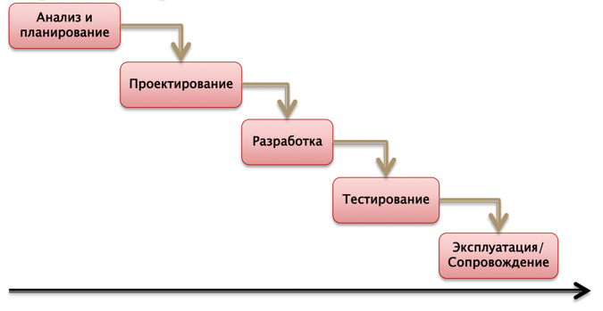

1. Анализ и планирование:
   1. Сбор требований 
   2. Анализ требований 
   3. Планирование проекта 
2. Проектирование 
   1. Разработка архитектуры 
   2. Разработка моделей данных 
   3. Разработка алгоритмов 
3. Реализация 
   1. Кодирование 
   2. Отладка 
4. Тестирование/верификация 
5. Сопровождение 
   1. Внедрение 
   2. Эксплуатация 
   3. Внесение изменений 

В исходном виде мало подходит к современным проектам.

Имеется несколько модификаций 

- Общепринятая линейная модель 
- Классическая итерационная
- Предложена У. Ройс, 1970 г. 
- Обратная связь после каждого этапа

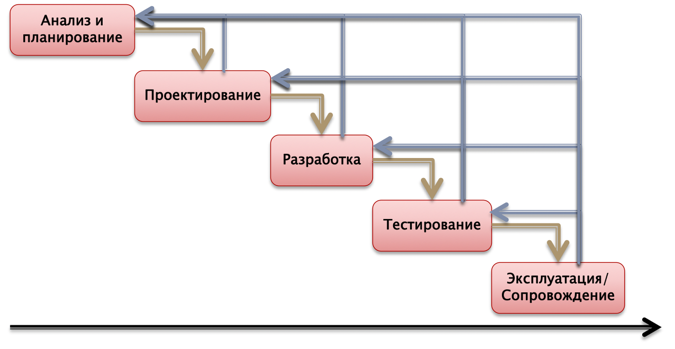

- Каскадная модель. Завершение каждого этапа проверкой

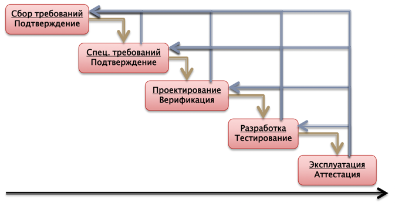

- Строгая каскадная модель Минимизация возвратов к пройденным этапам

  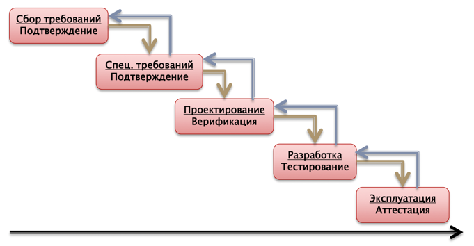

Достоинства: 

- Имеется план и график по всем этапам конструирования 
- Ход конструирования – упорядочен 
- Имеется богатый опыт использования 
- Понятна «большим» заказчикам: государственным, военным, финансовым организациям 

Недостатки: 

- Не всегда соответствует реальным проектам (отсутствует гибкость) 
- Часто всех требований на начальном этапе нет 
- Результат доступен только в конце

# 3. Стратегии конструирования ПО. Инкрементная модель

* Объединяет классический подход и макетирование
* Весь проект делится на инкременты – версии продукта с определенной функциональностью
* Для каждого инкремента выполняется: анализ, проектирование, разработка, тестирование
* Инкрементная стратегия
* Результат каждого инкремента – работающий продукт
  
  Достоинства:
* Имеется план и график по всем этапам конструирования
* Промежуточные версии доступны заказчику

  Недостатки:
* Часто всех требований на начальном этапе нет
* Не всегда можно заранее спланировать содержание версий
* Отсутствует гибкость

# 4. Стратегии конструирования ПО. Спиральная модель

* Предложена Б. Боемом, 1988г
* Основана на классическом жизненном цикле программного обеспечения и на цикличном макетировании
* Дополнена анализом рисков и моделированием
* Эволюционная стратегия
  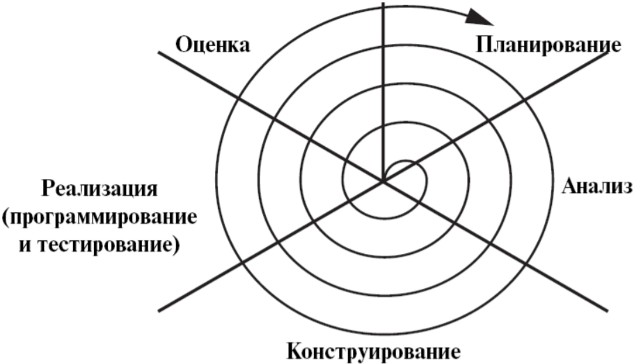
* Было отмечено, что основные компоненты спиральной модели - планирование, анализ, конструирование, реализация, оценивание - во время разработки повторяются, в измененном виде, но в данном порядке:
  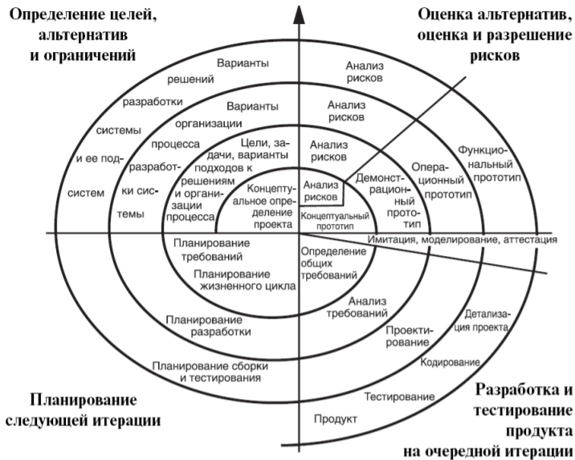
  
В конце каждого витка — цикла итераций — принимается решение, продолжать ли проект. Спиральная модель похожа на инкрементную, но здесь гораздо больше времени уделяется оценке рисков. С каждым новым витком спирали процесс усложняется.
  
Достоинства:
* Адекватно отражает эволюционный характер проектирования
* Позволяет явно учитывать риски на каждом витке эволюции, акцентирует внимание на них
* Использует моделирование и системный подход
* В зависимости от исполнения, могут быть промежуточные версии
  
Недостатки:
* Усложненность структуры модели, что приводит к сложности ее использования менеджерами и заказчиками
* Трудность контроля времени разработки и управления им
* Модель малополезна для проектов, имеющих низкую степень риска или небольшие размеры

# 5. Стратегии конструирования ПО. Быстрая разработка приложений (RAD) 

> http://kspt.icc.spbstu.ru/media/files/2021/course/se/SE2021_01_LifeCycle.pdf слайд 37

RAD = Rapid Application
Development

Концепция организации технологического процесса разработки программных продуктов, ориентированная на максимально быстрое получение результата в условиях сильных ограничений по срокам и бюджету и нечётко определённых требований к продукту. Эффект ускорения разработки достигается путём использования соответствующих технических средств и непрерывного, параллельного с ходом разработки, уточнения требований и оценки текущих результатов с привлечением заказчика. RAD создана в конце 1980-х как альтернатива более ранним каскадной и итеративной моделям. С конца XX века RAD получила широкое распространение. 

- Инкрементная стратегия конструирования
- Использование компонентно-ориентированного конструирования
- Обеспечение очень короткого цикла разработки (60-90 дней)
- Ориентирована в основном на разработку информационных систем

### Основные этапы

- Бизнес-моделирование
- Моделирование данных
- Моделирование обработки
- Генерация приложения
- Тестирование и объединение

### Бизнес-моделирование

- Моделируется информационный поток между бизнес-функциями
- Определяется:
  - Какая информация создается
  - Кто ее создает
  - Кто ее обрабатывает
  - Где информация применяется

### Моделирование данных

- По информационному потоку формируется набор объектов данных
- Определяются свойства объектов
- Специфицируются отношения между объектами

### Моделирование обработки

- Определение преобразований объектов данных
- Создаются описания для
  - добавления объектов данных
  - модификации объектов данных
  - удаления объектов данных
  - поиска объектов данных

### Генерация приложения

- Использование декларативных ЯП
- Использование готовых компонентов
- Создание повторно используемых компонентов
- Использования средств автоматизации

### Тестирование и объединение

- Тестирование упрощается из-за повторного использования компонентов

    > Они не требуют автономного тестирования

- Используется интеграционное тестирование

### Ограничения

- Область применения – проектирование информационных систем

- Производительность не является критичной

    > Неприменимо для задач реального времени

- Можно привлечь достаточно разработчиков

- Отсутствуют технические риски

RAD-технология не является универсальной, её целесообразно применять лишь если проект отвечает всем или некоторым из условий:

- Сжатые сроки.
- Нечётко определённые и/или изменяющиеся по ходу разработки требования.
- Ограниченный бюджет при готовности участия заказчика в разработке. 
- Небольшие объёмы либо возможность разбиения проекта на функциональные компоненты. 
- Графический интерфейс пользователя — важнейший или один из важнейших компонентов системы.
- Низкая вычислительная сложность.

# 6. Стратегии конструирования ПО. Унифицированные процесс разработки (RUP)

> http://kspt.icc.spbstu.ru/media/files/2021/course/se/SE2021_01_LifeCycle.pdf слайд 46

RUP использует итеративную модель разработки. В конце каждой итерации (в идеале продолжающейся от 2 до 6 недель) проектная команда должна достичь запланированных на данную итерацию целей, создать или доработать проектные артефакты и получить промежуточную, но функциональную версию конечного продукта. Итеративная разработка позволяет быстро реагировать на меняющиеся требования, обнаруживать и устранять риски на ранних стадиях проекта, а также эффективно контролировать качество создаваемого продукта. Первые идеи итеративной модели разработки были заложены в «спиральной модели».

Полный жизненный цикл разработки продукта состоит из четырёх фаз, каждая из которых включает в себя одну или несколько итераций

- Авторы:
  - А. Якобсон
  - Г. Буч
  - Дж. Рембо
- Продвигается IBM Rational
- Начало разработки - 1995 г.
- Первая версия RUP - 1998 г.
- Наиболее глубоко проработанная методология
- Инкрементная и эволюционная итеративная методология
- Базируется на широком использовании UML
- На всех стадиях используются программные метрики
- Процесс делится на этапы (стадии) - 4 штуки
- Каждый этап состоит из итераций
- Итерация – законченный цикл разработки, вырабатывающий промежуточный продукт

### Рабочие потоки процесса

- Бизнес-моделирование
- Управление требованиями
- Анализ и проектирование
  - Создание статического и динамического представления системы
- Реализация
  - Создание программного кода
- Тестирование
  - Проверка системы в целом

### Начальная стадия (Inception)

- Назначение
  - Запуск проекта
- Цели
  - Определение области применения
  - Определение элементов Use Case, критических для системы
  - Определение общих черт архитектуры
  - Определение общей стоимости и плана проекта
  - Идентификация основных элементов риска

При завершении начальной фазы оценивается достижение этапа жизненного цикла цели (англ. Lifecycle Objective Milestone), которое предполагает соглашение заинтересованных сторон о продолжении проекта. 

### Начальная стадия. Действия

- Формулировка области применения проекта
  - Выявление требований и ограничений
- Планирование
  - Подготовка основного плана развития и альтернатив развития для управления риском
  - Определение персонала
  - Определение проектного плана
  - Определение зависимостей между стоимостью, планированием и полезностью
- Синтез предварительной архитектуры
  - Развитие решений проектирования
  - Определение используемых компонентов (разработка, покупка, повторное использование)

### Начальная стадия. Артефакты

- Спецификация основных проектных требований
- Начальная модель Use Case (20%)
- Начальный словарь проекта
- Начальный план развития
- Начальная оценка риска
- Проектный план с этапами и итерациями

### Уточнение

В фазе «Уточнение» производится анализ предметной области и построение исполняемой архитектуры.

- Назначение
  - Создать архитектурный базис
- Цели
  - Определение оставшихся требований
    - Функциональные требования выражаются с помощью Use Case
  - Определение архитектурной платформы системы
  - Отслеживание рисков, устранение наибольших рисков
  - Разработка плана итераций этапа «Конструирование»

Успешное выполнение фазы уточнения означает достижение этапа жизненного цикла архитектуры (англ. Lifecycle Architecture Milestone). 

### Уточнение. Действия

- Развитие спецификации
- Формирование критических элементов Use Case, задающих дальнейшие решения
- Развитие архитектуры, выделение ее компонентов

### Уточнение. Артефакты

- Модель Use Case (80%)
- Дополнительные (в том числе нефункциональные) требования
- Описание программной архитектуры
- Действующий архитектурный макет
- Переработанный список элементов рисков и основной план развития
- План разработки всего проекта, включающий все итерации и критерий развития для каждой итерации

### Конструирование

В фазе «Построение» происходит реализация большей части функциональности продукта. Фаза Построение завершается первым внешним релизом системы и вехой начальной функциональной готовности (Initial Operational Capability). 

- Назначение
  - Создание программного продукта с начальной функциональностью
- Цели
  - Минимизация стоимости разработки
  - Быстрое получение требуемого качества
  - Быстрое получение версий

### Конструирование. Действия

- Управление ресурсами, контроль ресурсов
- Оптимизация процессов
- Полная разработка компонентов и их тестирование
- Оценивание реализаций продукта

### Конструирование. Артефакты

- Программный продукт, пригодный для отчуждения от разработчиков (альфа-, бета-версия и т.п.)
- Описание текущей реализации
- Руководство пользователя

### Внедрение (Transition)

В фазе «Внедрение» создается финальная версия продукта и передается от разработчика к заказчику. Это включает в себя программу бета-тестирования, обучение пользователей, а также определение качества продукта. В случае, если качество не соответствует ожиданиям пользователей или критериям, установленным в фазе Начало, фаза Внедрение повторяется снова. Выполнение всех целей означает достижение вехи готового продукта (Product Release) и завершение полного цикла разработки. 

- Назначение
  - Отдать программный продукт пользователям
  - Завершить выпуск продукта
- Действия в каждой итерации
  - Выпуск бета-версий или релизов
  - Исправление найденных в процессе бета-тестирования ошибок
- Результат
  - Законченный продукт

### Выводы

- Наиболее продуманная методология
- Подходит для больших и очень больших проектов (реже средних)
- Требует высокой квалификации участников

# 7. Стратегии конструирования ПО. Экстремальное программирование

Экстремальное программирование (extreme programming, XP) ориентировано на группы до 10 человек.

Вся группа обязательно находится в одном помещении.

Процесс:

- гибкий
- динамичный
- итеративный
- может быть изменяющимся - XP наиболее для этого подходит

Основные "занятия":

- написание кода
- тестирование
- получение требований/изменений от заказчика
- проектирование

Приспособление к изменениям (динамика) из-за:

- постоянной связи с заказчиком
- выбора простейшего решения
- быстрой обратной связи
- профилактики проблем

Основные практики XP:

- игра в планирование
  - от заказчика получаем объём работ, временные требования и сроки выпуска
  - от разработчиков - временные оценки, последствия и ход работы
- небольшие версии
  - выпуск маленьких и простых версий
  - версия обязательно должна быть завершённой
  - примерно 1 версия в 14 дней
- метафора
  - видение проекта с примерными требованиями архитектуры
  - сведения об архитектуре
- простой дизайн
  - проходят все тесты
  - отсутствует дублирующая логика
  - минимальное число классов/методов
  - новое добавляется только тогда, когда оно нужно
- тестирование
  - юнит-тесты для всего кода от разработчиков
  - функциональное тестирование от заказчика
  - код разрабатывается вместе с тестами или после них
- рефакторинг
  - изменение программы без фактического изменения функциональности
  - для упрощения добавления нового функционала
- парное программирование (!!!)
  - разработчики работают парами
  - тот, кто пишет код, думает над конкретной реализацией
  - тот, кто рядом, думает стратегически
  - состав пар меняется
- коллективное владение
  - код - общий, мгновенно изменяется при необходимости
- непрерывная интеграция
  - интеграция кода - постоянная, не реже одного раза в день
  - кончается после прохождения всех тестов
  - ответственные - те, кто внёс изменения
- 40ч рабочая неделя
  - переработки нежелательны, свидетельствуют о неправильной организации работы
  - отпуск обязателен
- локальный заказчик (!!!)
  - вместе с разработчиками обязательно присутствует представитель заказчика - тот, кто будет пользоваться продуктом
  - отвечает на возникающие у разработчиков вопросы
  - наличие представителя - способ наискорейшей коммуникации
# 8. Стратегии контруирования ПО. Test-driven development

- Разработка через тестирование
- Подход к разработке ПО, основанный на повторении коротких циклов разработки
- Предложен в 1999 году Кентом Беком, автором экстремального программирования как развитие принципа test first
- Вырос в отдельную методологию

- Основная идея – тесты разрабатываются ДО написания программного кода
- Разработка кода завершается запуском уже написанных тестов
- Требования к системе разбиваются на микротребования к небольшим функциям, которые задаются неявно в виде тестов

- Написание тестов для будущей функциональности
  - Тесты должны покрывать все возможные сценарии использования
  - Не должно быть ни одной возможности, не проверяемой тестами
  - Анализ, какие из существующих тестов должны быть переработаны в связи с новой функциональностью
- Запуск вновь созданных тестов
  - Если тест проходит – это плохой тест
  - Проходящий тест, для которого еще не написан код, ухудшает программу

- Написание кода
  - Цель – написать код, проходящий тесты
  - Лишняя нетестируемая функциональность не разрабатывается
- Запуск всех тестов
  - Если какие-то тесты не проходят – возврат к переработке кода
  - Если не проходят новые тесты – необходимо исправить разработанный компонент
  - Если не проходят старые тесты – необходимо переработать другие компоненты или тесты
- Переработка кода
  - Переработка созданного компонента
  - Переработка старых тестов
  - Переработка зависимых компонентов

- Рефакторинг
  - Переработка структуры программы
  - Устранение дублирования
  - Облегчение внесения изменений
- Если вся функциональность реализована, то текущий цикл разработки завершен

### Вставить картинку !!!!!!!!!!

### Принципы TDD
- KISS (keep it simple, stupid) – делай это проще, тупица
  - Разрабатывать надо как можно проще, принимать наиболее простые проектные и программные решения
- YAGNI (you aren't gonna need it) – тебе это не понадобится
  - Не разрабатывать функциональность, которая явно не нужна сейчас, то есть для нее нет тестов
- Fake it till you make it – подделывай, пока это не станет правдой
  - Массовое применение заглушек (fake, mock и т.п.) на этапе создания компонентов
  - Замена заглушек на компоненты по мере создания компонентов

### Достоинства TDD
- Разработка ведется небольшими контролируемыми фрагментами
  - В каждый момент времени разработчик думает об ограниченном фрагменте спецификации
  - Это упрощает анализ возможного пространства входных данных
  - Код получается более модульным и расширяемым
- Минимизация цены ошибки
  - В случае возникновения ошибки очень просто вернуть систему в рабочее состояние
  - Практически отсутствует необходимость отладки
  - Легко локализовать ошибку
- Ошибки обнаруживаются сразу после их появления
  - Постоянный запуск тестов гарантирует практически моментальное обнаружение ошибки
  - Малый размер тестов позволяет быстро локализовать причину ошибки
- Упрощение рефакторинга кода
  - Разработчик может быть уверен в том, что его изменения ничего не ломают
  - Облегчается раздельное владение кодом

### Недостатки TDD
- Синдром излишней уверенности
  - Большое число тестов создаёт иллюзию бесконечной надежности системы тестирования
  - При создании теста разработчик может сделать те же допущения, что и при разработке кода. Как следствие – пропуск важных траекторий выполнения программы
  - Некоторые возможности нельзя проверить тестами
- Трудности поддержания актуальной тестовой базы
  - При внесении изменений в интерфейсы компонентов системы необходимо соответствующим образом изменить и все тесты
  - Большое число тестов приводит к значительным затратам на рефакторинг тестов
- Невозможность тестирования сложного взаимодействия нескольких компонентов
  - Каждый тест проверяет отдельный ограниченный фрагмент функциональности системы
  - Взаимодействие компонентов затрагивает множество аспектов системы сразу

# 9. Стратегии конструирования ПО. Методология SCRUM

SCRUM изначально появился в компании Toyota. Подход оказался хорошо масштабируемым и переносимым на разработку ПО.

SCRUM:

- гибкий
- итерационный
- адаптируемый под многие процессы
- масштабируемый, что важно для гибких подходов
- применим к любым этапам/особенностям разработки ПО
- хорошо стыкуется с использованием ООП-подхода

Планирование реализуется с помощью спринтов:

- каждые 7/14/30 дней, не больше 30 дней
- реализует часть функциональности

Встречи разработчиков:

- до начала каждого спринта - sprint planning meeting
- ежедневно - тот самый scrum ("схватка с англ.")
- после конца спринта - спринт-ревью с демонстрацией результатов

Генерируемые артефакты:

- backlog 
  - список целей/задач, необходимых для реализации всего проекта
  - "журнал пожеланий проекта"
- sprint backlog
  - список целей/задач, необходимых для реализации спринта
  - "журнал пожеланий спринта"
- burndown chart (диаграмма сгорания задач)
  - показывает идеальный темп выполнения задач, текущее положение дел и "температуру" проекта
- scrum board
  - минимальный размер - 3 столбца: TODO, in progress и done
  - строки - либо зоны ответственности разработчиков, либо типы задач

Роли участников:

- основные
  - product owner
  - scrum master
  - scrum team
- остальные
  - пользователи
  - эксперты-консультанты

Ход работы (относительно выполнения задач):

- формируется product backlog (все изменения - только сюда)
- его небольшой кусочек выносится в sprint backlog (заморожен ДО КОНЦА СПРИНТА)
- команда независимо работает над своим спринтом
- на выходе - готовый кусок функционала

Ход работы (относительно зон ответственности):

- заказчик определяет функциональные требования, периодически их меняет
- владелец продукта расставляет приоритеты
- формируются группы (обычно 1-6, реже вплоть до 9) для выполнения отдельных частей проекта
- формируется project backlog
- формируется sprint backlog для каждой группы
- выполняются спринты (автономно)

На каждой scrum-встрече каждый из команды:

- рассказывает, что сделал за предыдущий день
- рассказывает, что сделает за сегодняшний
- рассказывает, что мешало работе (scrum master пытается разрешить эти проблемы)

SCRUM эффективен без каких-либо менеджеров из-за:

- ежедневных встреч для "синхронизации" работы
- небольших групп

SCRUM часто объединяется с прочими методологиями, сейчас почти отсутствует в чистом виде.

# 10. Стратегии контруирования ПО. Методология Канбан.

# 11. Стратегии конструирования ПО. Бережливая разработка ПО 

Разработана в компании Toyota. 
Является адаптивной эволюционной стратегией с рекомендуемой командой до 10 человек. Отличается низкой продолжительностью проекта, наличию промежуточных версий и пригодностью к работе с информационными системами.

Когда команда следует принципам бережливой разработки, она не просто выполняет задачи, а стремится сделать продукт с наименьшим количеством ошибок

## Идея:

Бережливость заключается в сокращении потерь. 
В компании вносят только те изменения, которые приносят пользу, требуют минимум затрат и отнимают не более 30% запланированного времени.

## Потери: 

- Потери при разработке ПО 
  - Лишние функциональные возможности. Делаем вещи, которые не нужны. 
- Избыточное проектирование (Overengineering)
  - Тратим много времени на "полировку", что не требуется для конечного продукта и только тратит время
- Незавершенные работы   
  - Незавершенные работы из-за изменений требований в процессе работы
- Поиск и исправление ошибок 
  - Время на поиск и исправление ошибок
- Ожидание 
  - Разные ожидания, когда мы ждем других разработчиков, результатов тестов и т.д.
- Избыточные процессы 
- Дефекты

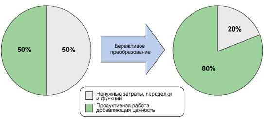

## Принципы:

- Исключение или уменьшение потерь 
  - Исключение того, что не приносит пользы.
- Постоянное обучение 
  - Активная обратная связь с заказчиком, чтобы своевременно появлялась информация об изменениях. Чтобы разработчики не тратили время на то, что системе не нужно или на то, что изменилось. 
- Позднее принятие решений 
  - Не прогнозы, а факты. Хотим сделать как можно проще не на основе прогноза о том, что будут сложные структуры, а на фактической реализации, т.е. когда в действительности становится фактом то, что нужно делать архитектуру сложнее. 
- Быстрая доставка 
  - Короткие итерации с передачей версий заказчику. 
- Мотивация команды 
  - Люди – не ресурс. Отношение к людям как к единомышленникам. Многие вопросы решаются совместно, распределение задач. Иными словами - максимальная вовлеченность команды в принятие решений. 
- Интегрирование 
  - Целостная архитектура. Понимание архитектуры заказчиком. Общее виденье о том, что происходит с системой и ее организацией
- Целостное видение 
  - Разделение разработчиками принципов бережливости.
  - Видение проекта как единое целое. 

В последнее время бережливая разработка очень популярна во многих отраслях.

# 12. Инженерия требований. Требования в программных проектах. Свойства требований

Разработка требований - самая сложная часть проектирования ПО.

Проблемы определения требований:

* Требования пользователей постоянно меняются;
* Требования (заказчика) бывают неясны, двусмысленны, противоречивы и неполны;
* Пользователи могут быть недостаточно представительны *(видим только один взгляд на систему от одной группы пользователей)*;
* Получаемые спецификации недостаточно детализированы для правильного проведения проектирования.

Требование - *(стандарт: IEEE 1990)*:

- Условие или возможность, необходимые пользователю для решения его задач или достижения цели;
- Условие или возможность, которым должна отвечать или которыми должна обладать система или ее компоненты, чтобы удовлетворить контракт, стандарт, спецификацию или иной формальный документ;
- Документированное представление условия или возможности, указанное в (1) и (2).

При сборе требований хочется определить некоторые свойства, позволяющие определить **качество** собранных требований. *They are as follows*:

- Корректность
- Однозначность
- Полнота
- Непротиворечивость
- Приоритизация
- Проверяемость
- Модифицируемость
- Отслеживаемость

### Подробнее о свойствах и зачем они вообще:

**Корректность** - требование корректно, если оно отражает пожелания заказчика.

**Однозначность** - возникает, если при решении можно воспользоваться разными способами решения задачи *(50 shades of grey for grey button)*. Требования однозначны, если их формулировка подразумевает только одну трактовку.

**Полнота** - требования полны, если **все** пожелания заказчика нашли отражения в списке требований.

**Непротиворечивость** - возникает из-за объема спецификации или в разных "специфицируемых" областях продукта *(неявные противоречия)*, обычно выявляется только путем глубокого анализа требований. Требования непротиворечивы, если нет нескольких требований, которые явно или неявно противоречат друг другу.

**Приоритизация** - требования должны быть разделены на относительные классы приоритетов, показывающие **значимость по времени или важности реализации** в системе.

**Проверяемость** - требования проверяемы, если они сформулированы таким образом, что каждое можно проверить и убедиться, выполнено оно или нет. Проверяемые требования обычно выражены **количественно**, непроверяемые - **качественно** *("быстрая работа" - качественное требование, плохое, в общем)*.

**Модифицируемость** - требования модифицируемы, если они сформулированы таким образом, что предполагают относительно простую их модификацию *(как свойство оно плохо формализуемо, но в целом нужно и важно)*.

**Отслеживаемость** - требования отслеживаемы, если по каждому требованию можно проследить:

* Реализовано ли оно?
* Где конкретно оно реализовано?
* Оттестировано ли оно?

# 13. Инженерия требований. Типы требований. Проблемы определения требований

Виды требований достаточно условно делят на две группы:

* **Функциональные** (функции, которые должна выполнять система) (***ЧТО нужно сделать?***) Формулируются как:
  * Бизнес-требования;
  * Пользовательские требования;
  * Собственно функциональные требования;
* **Нефункциональные** требования (***КАК нужно сделать?***):
  * Ограничения;
  * Требования к качеству;

Для различных систем одни и те же требования могут принадлежать к разным группам (real-time системы, где скорость работы - **функциональное** требование. Либо еще какой-нибудь пример с эргономикой для случаев, когда удобство пользователя стоит на первом месте). В целом именно поэтому деление условно. 

### Функциональные требования

* Определяют набор функций, которые необходимо реализовать;
* Отвечают на вопрос ***ЧТО надо сделать?***

По способу формулировки делятся на:

* Бизнес-требования:
  * Формулируются заказчиками;
  * Описывают цели, которых требуется достичь с данной системой;
  * Обычно - укрупненные, не содержат деталей;
  * (Глобально) определяют назначение ПО;
  * *Иногда описываются в документе о видении и границах проекта*.
* Пользовательские требования:
  * Какие задачи можно решить с помощью системы;
  * Формулируются со стороны пользователя.
* Функциональные требования:
  * Определяют требуемую функциональность.

Собранные бизнес-требования и пользовательские требования обычно анализируются и на их основе создают функциональные требования, которые, в свою очередь, документируют с помощью спецификации требований:

### Нефункциональные требования

* Отвечают на вопрос ***КАК надо сделать?***
* Характеристики качества включают требования к:
  * надежности,
  * совместимости,
  * эффективности,
  * гибкости,
  * эргономике,
  * безопасности.
* Ограничения:
  * на программные интерфейсы, в т. ч. к внешним системам,
  * требования к применяемому оборудованию и ПО *(совместимость с win10, например)*,
  * соответствие стандартам и правилам,
  * требования к архитектурным решениям *(- Почему это может быть требованием? - Например, если разрабатываем часть чужой системы со своей архитектурой, и пытаемся в нее вписаться)*,
  * бюджет,
  * сроки.

### Общие ограничения на требования

Правило "2 из 3":

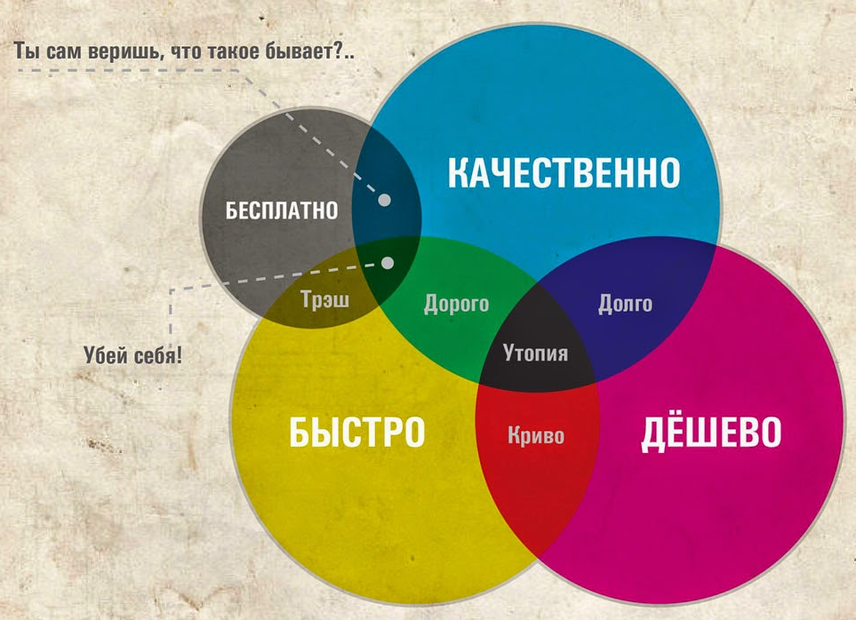

Что **НЕ** является требованиями?

* Детали архитектуры;
* Детали реализации;
* Сведения о планировании;
* Сведения о тестировании *(- Почему? - Пусть заказчик идет лесом, мы можем удовлетворить **уровень протестированности** (покрытие тестов, но это уже не о тестах, а о **требованиях к качеству**), а не написать ему N модульных тестов. Ицыксон сам толком не объяснил, почему, просто требование очевидно ненужное)*;
* Проектная информация *(оставьте менеджеру его работу!)*:
  * Процесс разработки;
  * Команда разработки;

# 14. Разработка требований. Выявление требований

Разработка требований - также отдельный этап инженерии требований. Ее разделяют на два этапа, результатом которых является **спецификация требований**.

### Выявление требований

Хотим узнать максимальное количество информации о разрабатываемой системе.

Используем все доступные средства, чтобы получить максимально возможный (пусть избыточный) объем требований заказчика.

Заинтересованные лица, участвующие в процессе:

* Заказчики;
* Менеджеры;
* Пользователи:
  * операторы,
  * администраторы,
  * ...
* Разработчики;
* Служба поддержки;
* Другие.

**Заказчик != пользователь**
Очень часто у заказчика и пользователя разные требования, заказчик может навредить пользователю при формировании требований.

*Классический подход (использовался ранее в классических методологиях разработки) подразумевал, что разработка требований и формирование спецификации требований - задача заказчика. Заказчик предоставляет исполнителю готовые требования.*

*Время показало, что подход нерабочий (заказчики не в состоянии сформировать спецификацию требований). Теперь **задача разработки требований - в первую очередь задача исполнителя**. Заказчик - главный источник информации, но окончательная спецификация требований остается за исполнителем. И этот этап - серьезная работа, котирую нужно оплачивать, выделять сроки, планировать...*

Способы выявления требований:

* Семинары;
* Интервью;
* Создание прототипов;
* Исследование;
* Работа с фокус-группами;
* *Остальные подобные перечисленным способы*.

**Семинар** - (самое популярное) открытое совместное обсуждение стоящих задач:

* Заказчик:
  * излагает имеющиеся требования,
  * отвечает на вопросы исполнителя;
* Исполнитель:
  * слушают требования заказчика,
  * задают уточняющие вопросы,
  * документируют требования.
    В результате формируются документы, после анализа превращающиеся в спецификацию требований.

**Интервью** - (если заказчик имеет смутное представление о разрабатываемом продукте, позволяет понизить требования к его IT-квалификации) целенаправленный опрос-интервью:

* Исполнитель:
  * готовит специализированный вопросник (анкету),
  * задает вопросы в соответствии с анкетой,
  * документирует ответы заказчика,
  * поясняет заказчику детали, если необходимо;
* Заказчик:
  * отвечает на вопросы исполнителя.

**Создание прототипов** - лучше один раз показать, чем много раз переспрашивать. Процесс:

* Обсуждение стоящих высокоуровневых задач;
* Исполнитель:
  * создает прототип,
  * демонстрирует,
  * исправляет недостатки,
  * документирует финальный прототип;
* Заказчик:
  * смотрит прототип и вносит изменения.

Прототипирование применяется, если:

* Имеются не все требования;
* Нужно быстро увидеть некоторые свойства продукта:
  * Удобство;
  * Внешний вид;
  * Применимость;
* Проектируются:
  * Информационные системы;
  * Программные продукты с ГПИ (GUI);

Для создания прототипа используются:

* Средства быстрой разработки приложений;
* Специальные средства макетирования.

Общее устройство прототипирования:

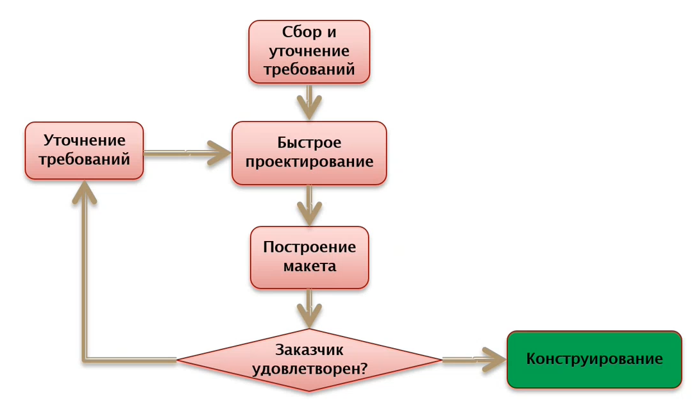

Достоинства:

* Обеспечивает определение полных требований к ПО;
* Наглядно для заказчика;
* Позволяет на ранних этапах увидеть основные параметры проекта.

Недостатки:

* По сути не отражает полный жизненный цикл;
* Заказчик может принять макет за продукт (важно этот момент довести до заказчика, лучше заранее);
* Разработчик может принять макет за продукт (ожидаемые проблемы: немасштабируемость, ненадежность, незащищенность, проблемы с обработкой ошибок...).

**Исследование** - исследуем рынок и потребности пользователя. Общий алгоритм:

* Исполнитель:
  * получает от заказчика общее представление о продукте *("- Хочу калькулятор, который завоюет рынок")*;
  * исследует рынок и выявляет востребованные характеристики продукта;
  * Анализирует решения конкурентов;
  * Документирует актуальные свойства проектируемого продукта;
* Заказчик:
  * Предоставление общего видения продукта;
  * Корректировка и утверждение предложения исполнителя.

**Работа с фокус-группами** - составляем фокус-группу из будущих пользователей и ориентируемся на них (что из самых важных функций должно быть и т.п.). Обсудив продукт с фокус-группой, формируем ТЗ и обсуждаем его с заказчиком.

# 15. Разработка требований. Анализ требований 

Разработка требований состоит из двух этапов: выявление (сбор) требований и анализ требований.
Результат всего этапа разработки требований - это разработка спецификации требований.

Последовательность такая: выявляем требования, потом анализируем, а после формируем спецификацию

Начинаем с выявления требований. Что такое выявление требований?

**Выявление требований** - процесс, в котором мы хотим узнать максимальное количество информации о разрабатываемой системе. Мы используем все доступные средства, чтобы получить максимальную, пусть избыточную, информацию о том что требуется заказчику. 

Обычно на этом этапе участвуют разные заинтересованные лица:

- заказчики (заказчик и пользователь - разные лица)
- менеджеры
- пользователи (операторы, администраторы, ...)
- разработчики
- служба поддержки
- другие лица

ВАЖНО: заказчик - это не пользователь! (заказчик - тот кто платит, пользователь - тот кто пользуется. У них разные требования и потребности)	

В разработке требований участвуют все.

Классический подход, который был, когда использовались классические методологии разработки, был немного другой. Идея такая: разработка требований, формирование спецификаций требований - задача заказчика, а исполнитель их реализует. Время показало что это не работает, потому что заказчик не способен сформировать корректно спецификацию требований, чтобы исполнители могли реализовать требования без доработок. 

Современный подход говорит о том, что разработка требований - задача исполнителя. Заказчик - главный источник информации.

**Анализ требований** - сходящийся процесс, который состоит из трех этапов:

1. Уточнение данных: 

   - каждое требование должно быть максимально полным.  
   - уточнение достигается путем повторных встреч с заинтересованными лицами. 
   - не должно появляться много новых требований - иначе следует вернуться к выявлению. 
   - на этапы уточнения требования должны быть описаны количественно, а не качественно, как было на этапе выявления. 

2. Приоритизация 

    Необходимо отсортировать требования по важности и срочности. Должны участвовать все заинтересованные лица проекта. **Все требования не могут быть основными. Заказчики должны это понять.** Приоритеты могут изменяться по мере развития проекта. Каждое требование относится к какой-либо качественной категории. Сортируются по двум измерениям, составляется матрицу приоритизации.
   - **по важности**: 

     - Высокая, средняя, низкая 

     - Обязан, должен бы, мог бы 

     - Основной, полезный, желаемый 
   - **по срочности**: 

     - Прямо сейчас, чуть позже, когда-нибудь 

     - Срочно, чуть позже, потом 

## **Вопрос: все ли требования собраны?** 

**Ответ:** очень сложно определить все ли требований собраны. Зачастую это зависит от опыта разработчика. Иногда список может получиться очень большой и важно остановится в нужный момент и расставить приоритеты. 

# 16. Документирование и организация требований. Российские стандарты спецификаций требований. 

Как документировать разные требования? 

Требования пользователей: 

- Пользовательские истории 
- варианты использования 

Бизнес-требования: 

- документ о представлении/границах проекта 

Функциональные требования: 

- спецификация требований к ПО 

Организация требований, группирование требований, собранных на предыдущих этапах 
	- требования объединяются в родственные группы 

Иерархическая структуризация требований 

- Подчинение 
- Уточнение 

В идеале мы представляем все собранные требования в виде дерева требований. 

### Способы документирования требований: 

- Документы на естественном языке (английский и на котором говоришь) 
- Графические модели: диаграммы, графы, схемы, потоки 
- Формальные спецификации. Излагаются на математическом языке, на котором требования не могут трактоваться двояко (язык темпоральной логики/ контрактное программирование). Документы на естественном языке полностью неформальны. 

### Документы этапа разработки требований: 

- спецификация требований (что требуется сделать) 
- критерии принятия работ (как будем проверять и сделано ли правильно) 
  Одно с другим связано и может быть одним документом. 

### Спецификация требований. 

Надо написать спецификацию. С чего начать? Есть стандарты, шаблоны. 

Фундамент всего последующего планирования, проектирования, реализации проекта. Основание для тестирования проекта 

Основание для документирования проекта 

Должна содержать ограничения проекта НО: не должна содержать деталей проектирования, реализации, тестирования и управления проектом. 

## Шаблоны спецификаций требований к ПО. 

Есть большое количество от советских до американских. 

- Существуют различные государственные, отраслевые и корпоративные стандарты - Наиболее распространены в России: 
- ГОСТ 19.201-78. Единая Система Программной Документации. Тех задание. Треб к содержанию и оформлению. Очень старый, но не такой плохой. 
- ГОСТ 34.602-89 “Техническое задание на создание автоматизированной системы” 

**Чем отличается ПО от авт. системы?**  Последнее - программно-аппаратный комплекс. Поэтому 34 гост - частичное отношение к разработке ПО 

#### **IEEE 830-1998 “Recommended practice for software requirements specification (SRS)”** 

Разрабатываются много других стандартов, которые могут применяться наравне с европейскими. 
- Следует при необходимости модифицировать шаблон в соответствии с природой и потребностями заказчика 
- Если заказчик не настаивает, гости и шаблон не должен быть догмой. То есть не надо следовать дословно. 
Исключение: корпоративный или военный заказчик. 
Полезный документ: IEEE Guide for Developing system requirements specifications 

#### **ГОСТ 19.201-78. ЕСПД. Техническое задание.** 

Доисторический гост. Выделенное знаком * - непосредственно относится к разработке ПО

- Основания для разработки 
- Назначение разработки 
- Требования к программе или программному изделию - касается нашего раздела (*)
- Требования к программной документации 
- Технико-экономические показатели 
- Стадии и этапы разработки 
- Порядок контроля и приемки - касается нашего раздела (*)
- Приложения 

Требования к программе или программному изделию: 
- Требования к функциональным характеристикам (функциональные требования) 
- Требования к надежности (не функциональные требования) 
- Условия эксплуатации (широко трактуются в этом госте: не только прогр. изделия, но и самого оборудования) 
- Требования к составу и параметрам технических средств (не функциональные требования) 
- Требования к информационной и программной совместимости (не функциональные требования) 
- Требования к маркировке и упаковке (перфокарты в те времена) (сейчас зачастую просто не указывается) - Требования к транспортировке и хранению (сейчас зачастую просто не указывается) 
- Специальные требования 

#### **ГОСТ 34.602-89 “Техническое задание на создание автоматизированной системы”**  

- Общие сведения 
- Назначение и цели создания (развития) системы 
- Хар-ка объектов автоматизации 
- Требования к системе 
- Состав и содержание работ по созданию системы 
- порядок контроля и приемки системы 
- требования к составу и содержанию работ по подготовке объекта автоматизации к вводу системы в действие (инсталляции) 
- требования к документированию (этап инженерии требований) 
- источники разработки 

Требования к системе: 
- Требования к системе в целом 
- Требования к функциям (задачам), выполняемым системой 
- Требования к видам обеспечения 

Требования к системе в целом: 
- Требования к структуре и функционированию системы 
- Требования к надежности 
- Требования к безопасности 
- Требования к эргономике и технической эстетике (не функциональное) 
- Требования к эксплуатации и техническому обслуживанию 
- Требования к защите информации от несанкционированного доступа 
- Требования по стандартизации и унификации Список не полный, только то что нам нужно 

Требования к функциям (задачам), выполняемым системой: 
- перечень подсистем, их назначение и основные хар-ки 
- Требования к способам связи для информационного обмена между компонентами системы 
- Требования к характеристикам взаимосвязей создаваемой системы со смежными системами 
- Требования к режимам функционирования системы 
- Требования по диагностированию системы 

# 17. Документирование и организация требований. Стандарт IEEE-830

IEEE 830-1998. Данная методика описывает рекомендуемые принципы составления спецификации требований к программному обеспечению.
Заменен ISO/IEC/IEEE 29148:2011.

Описаны содержание и качества хорошей спецификации требований к программному обеспечению (SRS, СТПО) и представлено несколько примеров схем SRS. Эта рекомендуемая практика направлена на определение требований к разрабатываемому программному обеспечению, но также может быть применена для оказания помощи в выборе собственных и коммерческих программных продуктов.

Согласно стандарту техническое задание должно включать следующие разделы:

1. Введение
   - Назначение
   - Область действия;
   - Определения, акронимы и сокращения;
   - Публикации;
   - Краткий обзор
2. Общее описание
   - Перспектива изделия
   - Функции изделия
   - Характеристики пользователей
   - Ограничения
   - Допущения и зависимости
   - Разделение требований
3. Специфические требования
   - Внешние интерфейсы
   - Функции системы
   - Требования к рабочим характеристикам
   - Логические требования к базе данных
   - Проектные ограничения
   - Атрибуты системы программного обеспечения (нефункциональные требования)

Для раздела "Специфические требования" существует несколько шаблонов, например:

### Шаблон 1. По режимам v1:

1. Требования к внешним интерфейсам

   - Интерфейсы пользователя

   - Аппаратные интерфейсы

   - Интерфейсы программного обеспечения

   - Интерфейсы связи

2. Функциональные требования

   - Режим 1
     - Функциональное требование 1.1
     - ...
     - Функциональное требование 1.n
     - ...
   - Режим 2
     - …
   Наблюдение за проектом - Режим m
     - …

3. Требования к рабочим характеристикам

4. Проектные ограничения

5. Атрибуты системы программного обеспечения

6. Другие требования

### Шаблон 2. По режимам v2:

1. Функциональные требования
   - Режим 1
     - Внешние интерфейсы
       - Интерфейсы пользователя
       - Аппаратные интерфейсы
       - Интерфейсы программного обеспечения
       - Интерфейсы связи
     - Функциональные требования
       - Функц. требование 1
       - …
       - Функциональное требование 
   - Режим 2
     - …
   - Режим m
2. Проектные ограничения
3. Атрибуты системы программного обеспечения
4. Другие требования

### Шаблон 3. по классам пользователей:

1. Внешние интерфейсы
   - Интерфейсы пользователя
   - Аппаратные интерфейсы
   - Интерфейсы программного обеспечения
   - Интерфейсы связи
2. Функциональные требования
   - Класс пользователей 1
     - Функциональное требование 1.1
     - …
     - Функц. требование 1.n
     - …
   - Класс пользователей 2
     - …
   - Класс пользователей m
     - Функц. требование m.1
     - …
     - Функц. требование m.n
     - …
3. Требования к рабочим характеристикам
4. Проектные ограничения
5. Атрибуты системы программного обеспечения
6. Другие требования

И другие.

# 18. Документирование требований. Критерии принятия работ. Программа и методика испытаний.

## Критерии принятия работ:

1. Должны быть приняты всеми заинтересованными лицами;
2. Должны быть четкими и недвусмысленными;
3. Разделы методики принятия работы должны определяться количественными параметрами, а не качественными;

## Программа и методика испытаний:

Программа и методика испытаний (ПМИ) — это технический документ, который формализует этап тестирования продукции и составляется на автоматизированную программу (АСУ) или систему. Документ предназначается для выявления параметров, которые обеспечивают определение причин сбоя, показателей качества системы, ее соответствие различным требованиям, проверку и получение проектных решений, а также характеризуют продолжительность и период испытаний.

Документ "Программа и методика испытаний" должен содержать следующие разделы:

1. Объект испытаний;
2. Цель испытаний;
3. Требования к программе;
4. Требования к программной документации;
5. Средства и порядок испытаний;
6. Методы испытаний.

В зависимости от особенностей документа допускается вводить дополнительные разделы.

- В разделе "Объект испытаний" указывают наименование, область применения и обозначение испытуемой программы.
- В разделе "Цель испытаний" должна быть указана цель проведения испытаний.
- В разделе "Требования к программе" должны быть указаны требования, подлежащие проверке во время испытаний и заданные в техническом задании на программу.
- В разделе "Требования к программной документации" должны быть указаны состав программной документации, предъявляемой на испытания, а также специальные требования, если они заданы в техническом задании на программу.
- В разделе "Средства и порядок испытаний" должны быть указаны технические и программные средства, используемые во время испытаний, а также порядок проведения испытаний.
- В разделе "Методы испытаний" должны быть приведены описания используемых методов испытаний. Методы испытаний рекомендуется по отдельным показателям располагать в последовательности, в которой эти показатели расположены в разделах "Требования к программе" и "Требования к программной документации".
- В методах испытаний должны быть приведены описания проверок с указанием результатов проведения испытаний (перечней тестовых примеров, контрольных распечаток тестовых примеров и т.п.).

Протокол испытаний является документом, который содержит результаты исследований (испытаний) и измерений, на основании которых принимается решение о соответствии продукции требованиям технических регламентов, документам по стандартизации или условиям договоров.

# 19. Изменения требований.

### Цели: 

- Управление изменениями требований 
  - Предложение изменений
  - Анализ изменений 
  - Принятие решений 
  - Обновление требований 
  - Обновление планов
- Контроль версий требований 
  - Определение схемы идентификации версий 
  - Определение версий спецификаций требований 
  - Определение версий отдельных требований
- Контроль состояния требования 
  - Определение состояния требований 
  - Регистрация состояния требования
- Прослеживаемость требований 
  - Определение связей с другими требованиями 
  - Определение связей с другими элементам системы
- Автоматизация управления требованиями

### Основные моменты изменений:

- Причины изменений требований
- Условия возможности изменений
- Политика управления изменениями 
- Анализ влияния изменения 
- Принятие/непринятие изменений

### Причины изменения требований

- Заказчик
  -  Не понравилось после просмотра 
  - Передумал 
  - Забыл 
- Рынок 
  - Такой продукт уже не продать 
  - Нужно выйти на рынок прямо сейчас, иначе этот продукт не продать 
- Разработка 
  - Неточное определение границ проекта 
  - Требования плохо определены 
  - Требования не были поняты или были поняты неправильно 
  - Сработали архитектурные риски

### Условия возможности изменения требований

- **Водопадные стратегии** - практически не возможно
- **Инкрементные стратегии** – возможно с некоторыми ограничениями (на определенных этапах)
- **Эволюционные стратегии** - возможно (специализированы на проектах с изменениями требований)

### Политика управления изменениями

- Должен быть принят **процесс контроля за изменениями**
- Все изменения должны **следовать процессу** или **не рассматриваться** 
- Для неутвержденных требований не выполняется никаких действий, кроме исследования осуществимости 
- Все запросы на изменение должны быть одобрены советом по управлению изменениями 
- Содержание запроса на изменение должно быть доступно всем заинтересованным лицам проекта 
- Начальный текст запроса должен быть неизменным 
- Анализ воздействия должен проводиться для каждого изменения 
- Каждое одобренное изменение (добавленное требование) должно прослеживаться до запроса на изменение 
- Обоснование каждого одобрения на изменение должно быть задокументировано

### Анализ влияния изменения

- Выявление последствий внесения изменения
- Определение всех артефактов (файлы, модели, документы, шаблоны, …), которые нуждаются в модификации, если изменение будет принято
- Определение задач, необходимых для реализации изменения 
- Оценка усилий для завершения этих задач 
- Оценка нахождения этих задач на критическом пути проекта 
- Оценка влияния на график работ 
- Оценка влияния на стоимость 
- Оценка приоритета изменения, учитывая 
  - Достоинства 
  - Недостатки 
  - Затраты 
  - Риски

### Решения на запрос

- Отказ
- Принятие
  - С изменением сроков работ 
    - Формирование нового графика работ 
  - Без изменения сроков работ 
    - Откладывание низкоприоритетных требований 
    - Привлечение дополнительных сотрудников 
    - Организация краткосрочной сверхурочной работы 
    - Пожертвование качеством

# 20. Управление версиями требований. Отслеживание требований.

### Управление версиями требований

- Требования могут устаревать 
- Требования могут быть противоречивыми 
  - поддержка нескольких версий проекта одновременно (long-time, latest, beta)
- Контроль версий документов 
  - С помощью любой системы контроля версий 
- Контроль версий требований 
  - Создание начальных версий требований 
  - Ведение истории изменений 
  - Авторизованный доступ к изменениям требований

### Состояния требований

- **Принято** - Требование было выставлено авторизованным источником;
- **Одобрено** - Требование было проанализировано и одобрено для определенной версии;
- **Реализовано** - Код, реализующий требование, был написан;
- **Проверено** - Корректная функциональность данного требования была подтверждена версией продукта; Требование может быть прослежено до варианта тестирования;
- **Удалено** - Ранее одобренное требование было исключено из базисного списка; Причина удаления – задокументирована;
- **Отклонено** - Предложенное требование – отклонено; Причина отклонения – задокументирована.

### Отслеживание состояний требований

- Показатель прогресса проекта 
- Используется при анализе изменений 
- Обосновывает некоторые решения, принятые во время разработки 
- Обычно измеряется в процентах завершенности работ (грубая оценка)
  - Часто может вводить в заблуждение

# 21. Прослеживание требований.

**Цели:** 

- Получить подтверждение, что цели были реализованы 
- Убедиться, что требования были протестированы 
- Иметь трассы всех требований от заказчика до тестовых случаев

### Типы связей:

- Потребности заказчика с разработанными требованиями 
- Требования с исходными потребностями заказчика 
- Требования с определенными элементами продукта 
- Определенные элементы продукта с соответствующими требованиями

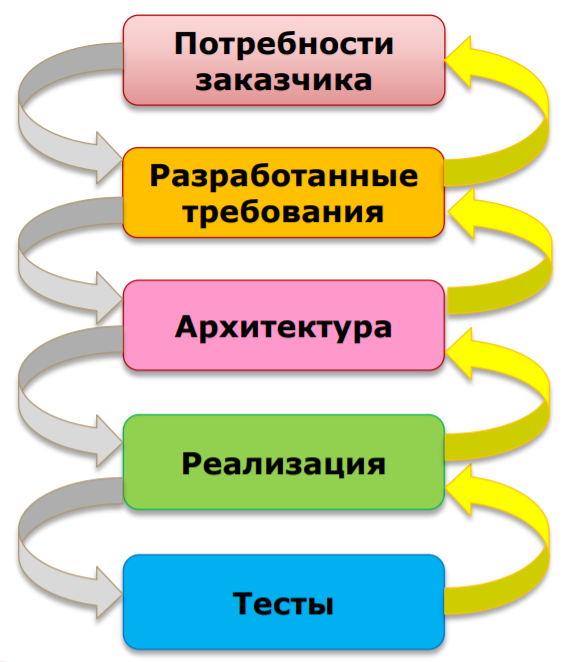

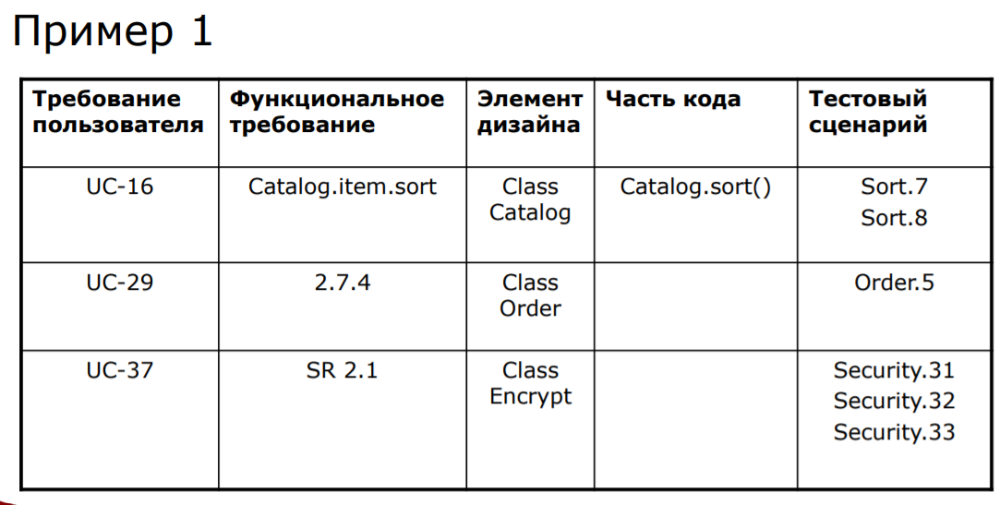

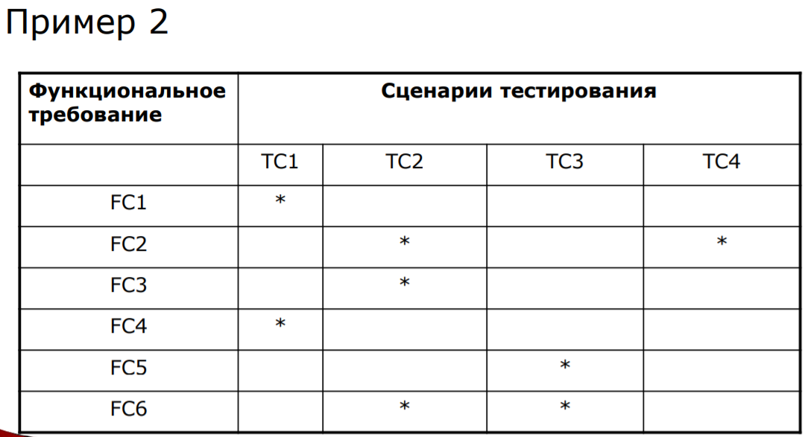

# 22. Ресурсы в программных проектах. Управление ресурсами 

**Ресурс** – объект проекта, подлежащий управлению и планированию, без которого невозможно выполнить какую-либо задачу программной инженерии. 

## Виды ресурсов: 

- Сотрудники 

  - Разделение на роли: Заказчик (customer), Менеджер проекта (project manager), Руководитель команды (team leader, team lead), Разработчик (developer), Тестер (tester, QA) и т.д.
    - Роль - конкретное амплуа сотрудника в конкретном проекте в определенное время. В программных проектах обычно оперируют ролями, а не сотрудниками

- Рабочее время 

  - Свойство сотрудника занимать какую-то роль определенное время в проекте. Является атрибутом связи «сотрудник-роль».

  Должно учитываться при формировании команды: 

  - Нестандартное время работы 
  - Выходные 
  - Сверхурочные 
  - Отпуска 
  - И т.д.

  Отдельно стоит учитывать праздники (особенно при транснациональном проекте), т.к. это может влиять на стоимость проекта, время старта/финиша проекта и т.д.

  В общем случае является внешним ограничением при решении задачи планирования

- Оборудование 

  Варианты:

  - Специализированное оборудование для разработки проекта 
  - Специализированное оборудование для исполнения проекта 
  - Специализированное оборудование для тестирования проекта 

- Машинное время

  - Если оборудование является узким ресурсом, тогда, то время, которое мы можем пользоваться в целях создания/тестирования проекта, является ресурсом, которым необходимо управлять

- ПО (ОС, среда разработки, специализированный софт и т. д.)

  Варианты:

  - ПО для разработки проекта 
  - ПО для исполнения проекта 
  - ПО для тестирования проекта 

Оборудование/машинное время или ПО может стать узким местом, если одновременно требуется разработчикам для отладки, тестирования для отладки и заказчику.
Этих элементов оборудования может быть недостаточное число, в результате чего возникают проблемы.

Оборудование, машинное время и ПО в общем случае являются внешними ограничением при решении задачи планирования.

# 23. Роли участников в программных проектах

**Роль** - конкретное амплуа сотрудника в конкретном проекте в определенное время. 
В программных проектах обычно оперируют ролями, а не сотрудниками.

Состав, назначение и функциональные обязанности ролей зависят от конкретного процесса разработки в компании. 
В принципе возможно совмещение разных ролей в разных проектах.

## Роли в процессе разработки программных проектов:

- Основные:
  - __заказчик__ (customer)
  - __планировщик ресурсов__ (planner)
  - __менеджер проекта__ (project manager)
  - __архитектор__ (architect)
  - __руководитель команды__ (team leader, team lead)
  - __разработчик__ (developer)
  - __тестер__ (tester, QA)
  - __разработчик документации__ (technical writer)
  - __пользователь__ (user)
  - __инженер группы поддержки__ (support engineer)

- Дополнительные:
  - __эксперт предметной области__
  - __специалист по пользовательскому интерфейсу и эргономике__
  - __ответственный за выпуск релизов__
  - и т.д.

## Конкретнее о некоторых ролях:

### Заказчик:

- Инициирует разработку
- Участвует в сборе требований
- Участвуете в разработке спецификаций требований
- Принимает результаты разработки

### Планировщик ресурсов:

- Член руководства организации 
- Выдвигает и координирует требования к проектам в организации
- Развивает и направляет план выполнения проекта с точки зрения организации
- Обеспечивает финансирование проекта

### Менеджер проекта:

- Внешние функции:
  - взаимодействия с _заказчиком_ и _планировщиком ресурсов_
- Внутренние функции:
  - Распределяет задачи среди членов команды
  - Организует выполнение проекта
  - Контролирует процесс разработки

### Архитектор:

- Проектирует архитектуру системы
- Разрабатывает основные проектные решения
- Определяет общий план развития проекта
- Определяет инфраструктуру разработки

### Руководитель команды:

- Является "главным разработчиком"
- Осуществляет техническое руководство командой
- Разрешает технические вопросы

### Разработчик:

- Реализует проектируемые компоненты
- Создает классы и методы
- Осуществляет кодирование
- Разрабатывает модульные тесты
- Выполняет автономное тестирование
- Внутри команды может иметь специализацию

### Тестировщик:

- Проверяет качество программного обеспечения (функциональность, надежность, эффективность и т.д.). 
  Составляет тесты для каждой фазы проектирования продукта.
- Исполняет созданные тесты
- Выполняет функциональное тестирование 
- Выполняет интеграционное, системное тестирование

### Разработчик документации: 

- Разработка программной документации
- Разработка эксплуатационной документ
- Ведение информационной поддержки процесса разработки

### Пользователь:

- Не является заказчиком проекта
- Может являться, а может и не являться сотрудником проекта
- Является главным потребителем проекта
- Обычно существуют группы пользователей проекта

### Эксперт предметной области: 

- Обеспечивает информационную поддержку в предметной области проекта
- Может быть несколько экспертов, если проект большой

### Специалист по пользовательскому интерфейсу и эргономике:

- Проектирует пользовательские интерфейсы
- Взаимодействует с заказчиком
- Анализирует и оценивает комплексные характеристики интерфейса:
  - Удобство
  - Эргономичность
  - Лаконичность 
  - Дружественность
  - Локализуемость
  - ...

### Ответственный за выпуск релиза:

- Определяет и реализует политику выпуска релизов
- Формирует и проверяет требования к конкретному релизу:
  - Необходимая функциональность
  - Состав релиза
- Определяет дату выхода релиза
- Контролирует процесс выхода релиза

### Библиотекарь:

- Ведет библиотеку проекта
- Контролирует соответствие выпускаемого продукта принятым стандартам

## Совмещение ролей

# 24. Проектные активности программных проектов

- **Программный проект** - самостоятельно управляемый элемент разработки
- Нормальный результат программного проекта - **программный продукт**

Для того чтобы пройти все эти стадии, нам необходимо управлять не только ресурсами, но и теми сущностями, что у нас есть внутри программного проекта.

Сущностей довольно-таки много и в общем случае разработчик, работая над проектом, обычно занимается двумя основными активностями:

1. Выполнение задач из ТЗ (подчиненных проектов, работ, реализация изменений)
2. Исправление дефектов (bug fixing)

Принципиальное отличие первого пункта от второго - первое, то что входит в проектный план, это запланированные активности, которыми разработчик должен заниматься для удовлетворения требований ТЗ, в то время как исправление дефектов - это непрогнозируемая активность, которой разработчик начинает заниматься в случае, если тестировщик обнаружил ошибки в программном коде, в функционировании программной системы.  

Сколько будет найдено ошибок, когда они будут найдены, насколько сложны эти ошибки, спрогнозировать невозможно, поэтому кроме прогнозируемых активностей разработчик занимается непрогнозируемыми активностями.

# 25. Временные сущности программных проектов

Временные сущности проектов:   

- Этапы (**stage**)
- Вехи (**milestone**)

## Этап программного проекта

**Этап проекта** – множество задач проекта, подчиненных достижению какой-либо локальной цели.   
Обычно этап – элемент проекта, видимый Заказчику. Заказчик может контролировать выполнение этапа.   
К этапам обычно привязано финансирование проекта.   
Завершение этапа может сопровождаться:

- Созданием макета
- Выпуском версии продукта
- Реализации компонента продукта
- ...

По окончании этапа можно принимать кардинальные (важные) решения:

- Продолжение проекта или его завершение (прекращение)
- Перепланирование проекта
- Изменение финансирования
- ...

Обычно в договоре между Заказчиком и Исполнителем указано, после какого этапа какие решения можно принимать.

## Вехи проекта

Веха (**milestone**) – законченная часть какого-либо этапа работы.  
Веха используется, чтобы примерно понимать как быстро происходит разработка проекта.   
Вехи стараются делать равномерными и небольшими по времени (например, каждую неделю), а задачи разбивать на подзадачи, чтоб они полностью входили в этот интервал.   
Достижение вехи можно наблюдать и контролировать.   
Вехи – те контрольные точки, по которым можно грубо оценить успешность всего проекта.   
В зависимости от способа организации проекта веха может быть:

- Видимой только Менеджеру проекта (внутренний ориентир)
- Видимой Менеджеру и Заказчику (так же, как и этап)

## Выполнение проекта

Процесс выполнения программного проекта – взаимосвязанное существование во времени:

- Проектных активностей
- Ресурсов
- Временных сущностей

# 26. Визуализация плана

Визуализация – основной способ планирования, контроля и наблюдения за программным проектом.

Визуализировать план можно только для **классических** методологий (у **Agile** методологий нет исходного плана).
Существует два основных подхода:

- Диаграммы Ганта
- Диаграммы PERT

## Диаграммы Ганта

Придуманы Генри Гантом в 1910 году и использовались во время проектирования и постройки кораблей.   
С конца 20-го века Диаграммы Ганта стали использоваться в программной инженерии как один из стандартных способов визуализации плана проекта.

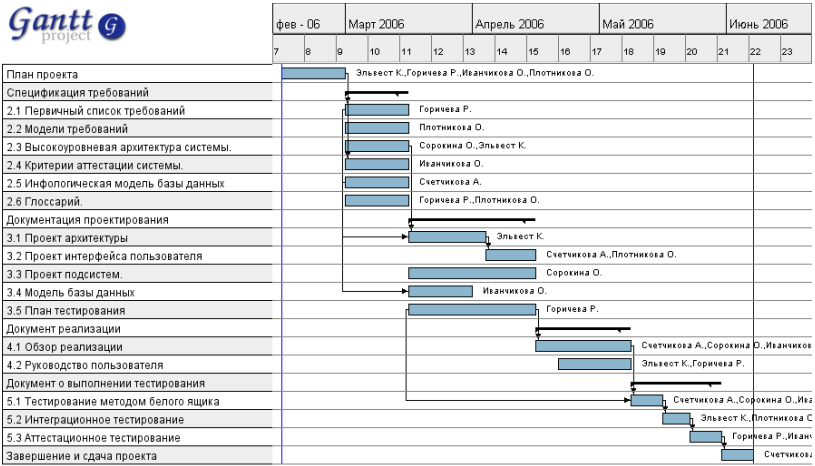

Легенда:

| Что?                              | Зачем?                                                                           |
|-----------------------------------|----------------------------------------------------------------------------------|
| Список задач (слева)              | Задачи, которые необходимо выполнить                                             |
| Временной интервал (сверху)       | Время, за которое эти задачи необходимо выполнить (дни, недели, месяцы и т. д.)  |
| Синие прямоугольники              | Задачи, примерно распределённые по времени в соответствии с планом проекта       |
| Надписи (у синих прямоугольников) | Ресурсы, требующиеся для выполнения этой задачи (например, конкретный сотрудник) |
| Стрелочки                         | Информационная зависимость между задачами (последовательное выполнение)          |
| Чёрные жирные линии               | Контейнеры (агрегаторы), соответствующие группе задач - этап проекта             |

Достоинства:

- **Наглядность**: ширина прямоугольников строго пропорциональна времени выполнения этой задачи
- **Привязка к временной оси**
- Вертикальная черта - срез по задачам
- Иногда прямоугольники показывают в виде **progressBar**'ов, если есть связь с **BugTracking**'ом (все средства управления проектом автоматизированы и интегрированы между собой) 

Недостатки:

- Не настолько информационно мощный, как Диаграммы PERT

Программные продукты:

- GanttProject
- OpenProj
- EdrawSoft
- MS Project
- MS Visio
- MS Excel
- другие...

Многие продукты позволяют рисовать Диаграммы Ганта в автоматическом режиме.

## Диаграммы PERT

Program Evaluation and Review Technique, 1958 год.   
Другие названия: сетевой график, сетевой план-график.

Отличие от Диаграммы Ганта в большей формальности.

Легенда:   

| Что?                                        | Зачем?                                                                          |
|---------------------------------------------|---------------------------------------------------------------------------------|
| Узлы графа                                  | Вехи проекта (**milestones**), место соединения и распараллеливания задач       |
| Цифры в узлах                               | Краткое обозначение узла                                                        |
| Рёбра (дуги) графа                          | Задачи, которые необходимо выполнить                                            |
| Обозначение дуг (Заглавные латинские буквы) | Краткое обозначение задачи                                                      |
| Вес ребра                                   | Время, за которое эту задачу необходимо выполнить (дни, недели, месяцы и т. д.) |

Применяется для анализа критического пути проекта или запасов по времени, при изменении проекта.

Достоинства:

- Формальный граф со связями, по которому легко найти критический путь проекта (цепочка задач, которая определяет общее время выполнения проекта)
- Задачи, которые не попали в критический путь, могут понадобиться Менеджеру проекта, например, при перепланировании проекта
- Можно решать задачи на графах (поиск самого короткого пути, поиск самого длинного пути и т. д.)

Недостатки:

- Нет оси времени, что уменьшает наглядность диаграммы
- Нет общего списка задач (задачи разбросаны по всей плоскости)

Выход - нечто среднее между Диаграммой Ганта и Диаграммой PERT:

- Вводят ось времени
- Проекция задачи на ось времени должна быть пропорциональна времени выполнения этой задачи

Инструменты создания PERT-диаграмм:

- Edrawsoft
- Creately
- SmartDraw
- MS Project
- MS Visio
- другие...

Инструменты позволяют интегрировать Диаграммы PERT, например, с системой **BugTracking**'а или с системой управления требованиями.

# 27. Наблюдение за программным проектом

**Наблюдение за проектом** – процесс контроля хода выполнения проекта на основе анализа артефактов проекта.

Можно наблюдать за:   

1. Программными активностями:

    - Задачи   

    - Исправляемые дефекты   

    - Фиксации изменений (коммитов)

2. Ресурсами:

    - Сотрудники   

    - Оборудование   

    - ...

3. Соблюдением временных сущностей:

    - Этапы   

    - Вехи   

    - Критический путь проекта

Из этого возникают следующие виды срезов: 

- По задачам
- По сотрудникам
- По вехам
- По дефектам
- По фиксации изменений (коммитов) в СКВ (Система контроля версий)
- По соблюдению критического пути проекта
- ...

## Срез по задачам 

- Сотрудники, занятые решением задачи (ресурсы, которые необходимы для решения этой задачи)
- Соответствие задач – графикам (Диаграммы Ганта и PERT)
- Процент завершенности по задачам проекта
- Общее количество дефектов у задачи
- Количество незакрытых дефектов у задачи
- ...

Большое количество дефектов у задачи может показывать хорошую работу тестировщиков, или разработчики пишут мало **unit**-тестов и не занимаются отладкой своего кода.    

## Срез по сотрудникам

- Текущие задачи сотрудника (больше 3-х - плохой признак)
- Отставание сотрудника от графика (плохо работает, или слишком много задач)
- Общее количество дефектов, относящихся к сотруднику
- Количество незакрытых дефектов, относящихся к сотруднику
- ...

## Срез по дефектам

- Количество дефектов для каждой задачи (распределение дефектов между задачами должно быть примерно равномерным)
- Количество незакрытых дефектов для каждой задачи
- История изменения дефектов
- Среднее время исправления дефекта
- Среднее количество дефектов (открытых и закрытых) у сотрудников
- Распределение дефектов по сотрудникам
- ...

По этому срезу можно анализировать неравномерность загрузки проекта.

## Срез по фиксациям изменений (коммитов) в СКВ

- Среднее число коммитов на сотрудника за единицу времени
- Равномерность коммитов у сотрудников
- ...

## Срез по критическому пути проекта

- Сотрудники, выполняющие задачи в критическом пути (ключевые сотрудники)
- Задачи в критическом пути
- Временные запасы в критическом пути (экономия времени на выполненных задачах).
  Это время может быть потрачено на дополнительное тестирование проекта.

# 28. Управление риском в программных проектах: идентификация, анализ, ранжирование

**Риск** - возможность неудачи, неудовлетворительного результата

Риски в программных проектах:

- Бюджет (Превышение бюджета)
- Сроки (Превышение сроков)
- Функциональность (Низкая надежность, Некорректное функционирование, Низкое качество)

**Формула для расчета риска:**
R = P(UR)*L(UR)

 - R - показатель риска
 - P - вероятность неуспешного результата 
 - L - потери от неуспешного результата

Управление риском:

 - Идентификация риска
 - Анализ риска
 - Ранжирование риска 
 - Планирование управления риском 
 - Разрешение риска
 - Наблюдение за риском

### Идентификация риска:

Обнаружение всех рисков которые присутствуют в проекте
Риски можно разделить на 3 категории:

 - Проектные риски
 - Технические риски
 - Коммерческие риски

Проектные риски:

 - Это риски связанные с самим выполнение проекта (Выбор бюджета, план, человеческие ресурсы проекта)
 - Формирование требований к продукту
 - Проблемы с кадрами (Кто-то может заболеть, уволится)
 - Сложность, размер, структура программного проекта
 - Методика взаимодействия с заказчиком

Технические риски:

 - Трудности этапов проектирования, реализации, тестирования, сопровождения
 - Неполнота или неточность спецификаций
 - Сомнительность принятых технических решений

Коммерческие риски:

 - Продукт не требуется на рынке
 - Продукт слишком устарел
 - Продукт слишком новаторский
 - Возможность прекращения финансирования

### Анализ риска:

Оценка вероятности возникновения каждого типа рисков и величины потерь

 - Вероятности определяются на основе экспертных оценок и статистики
 - Все риски заносятся в таблицу:

### Ранжирование риска:

- Сортировка рисков, пропорционально влиянию
- 20% элементов риска – обычно составляют 80% суммарного проектного риска

# 29. Управление риском в программных проектах: планирование, разрешение, наблюдение.

### Планирование управления рисками.

Цель – сформировать набор функций управления каждым элементом риска

Выбираются эталонные уровни риска – такие которые могут быть причиной прекращения проекта:

 - Превышение стоимости
 - Срыв планирования
 - Деградация технических показателей (характеристик)

Как формируются эти уровни риска? Они формируются отдельно по всем показателям: 
по стоимости, по времени и по качеству, и формируются они качественно. 
Например, делается следующим образом: уровни влияния на стоимость - вводятся пять качественных уровней, в которых мы определяем степень влияния риска на стоимость проекта.

Уровни влияния на сроки:

Уровни влияния на технические показатели:

Уровни вероятности:

Дальше на основании всего это строим матрицу риска

В данном случае пример: это такая двумерная табличка - по вертикали указывается вероятность, по горизонтали последствия, квадратики 1, 2, 3, 4, 5 - это качественные уровни. Дальше это все красится: зеленый цвет - все в порядке,
желтый цвет - в общем ситуация близкая к опасной, и красный цвет - мы близки к провалу. 

Почему именно такая раскраски? Почему по диагонали?

R = P * L - гипербола - показывает линии равного уровня влияния (в каждой точки гиперболы произведение p*c одинаковое - одинаковый уровень риска)

Условно говоря то, что выше верхней прямой, мы раскрашиваем красным. То, что между желтым и зеленым, то есть мы берем два уровня - один уровень критический, при котором все ломается и совсем все плохо, и второй соответственно предупредительный, когда все не очень плохо. А то, что получились такие квадратики это аппроксимация гиперболы, то есть это не аппроксимация прямой, а гиперболы, т.е. если у вас будет не пять уровней, а например десять, то ситуация будет гораздо более точная. 

Дальше:

 - Строятся зависимости между элементом риска и эталонными уровнями риска
 - Строится план управления каждым элементом риска
 - План интегрируется в общий план проекта

### Разрешение риска

Это плановое применение действий по уменьшению риска. 

### Наблюдение

 - Цикличность
 - Корректировка

### Методика управления рисками №2

### Стандарты управления рисками

# 30. Понятие дефекта программного обеспечения. Характеристики дефектов

### Понятие дефекта программного обеспечения

**Дефект (ошибка, проблема, баг)** - обнаруженная в процессе разработки, тестирования или эксплуатации ошибка в 
разрабатываемом приложении. 
Это может быть отклонением от спецификаций программного обеспечения, и дефекты
требуют исправления. Исправление дефекта является самостоятельной проектной активностью.

### Характеристики дефектов

Характеристиками дефекта являются:

- **Идентификатор дефекта** - это ID дефекта, который должен
  - Быть уникальным среди **всех** проектов предприятия (все проекты делят общее пространство ID дефектов)
  - Должен существовать простой механизм поиска дефекта по его ID
  - Должен быть постоянным в процессе жизненного цикла проекта, так как
    - На дефект могут быть ссылки в документации
    - Могут быть ссылки от внешних заинтересованных сторон
    - Могут быть ссылки по зависимостям
- **Состояние дефекта**
  - Показывает этап жизненного цикла дефекта. Возможные состояния:
    - Новый
    - Взятый на исправление
    - Исправленный
    - Закрытый (исправленный и проверенный)
    - Незакрытый (исправленный, но проваливший проверку)
    - Отклоненный
    - Дубликат
    - Заново открытый
    - Приостановленный
    - Требующий пояснения
    - Не проявляющийся
    - (и т.п. в зависимости от проекта, политики и другого)
- **Описание дефекта**
  - Текстовое описание, дающее исчерпывающее представление о проявлении дефекта. 
    По этому описанию должно быть возможно повторить условия, в которых проявляется дефект. Например:
    - Шаги воспроизведения
    - Фактический результат
    - Ожидаемый результат
  - Может содержать ссылки на требования и т.п.
- **Автор**
  - Автор – лицо (сотрудник), обнаружившее дефект
  - Автором может быть
    - Тестер
    - Заказчик
    - Пользователь
    - Разработчик
    - любой, имеющий права фиксировать дефекты для данного проекта
- **Время обнаружения**
- **Контекст**
  - Дефект обычно связан с каким-либо проектом или задачей 
    (например, дефект относится к такому-то проекту и появился в результате выполнения такой-то user story)
  - Должна указываться версия (версии) проекта или задачи. 
    В процессе жизненного цикла проект и версия могут уточняться
- **Срочность**
  - Приоритет дефекта
  - Показывает относительную срочность исправления дефекта с точки зрения нашедшего его
  - Обычно выражается в относительных единицах: `низкая`, `средняя`, `высокая`, `срочная`
- **Серьезность (важность)**
  - Показывает степень влияния проявления дефекта на проект
  - Косметический дефект
    - Рабочий дефект
    - Дефект, вызывающий зависание приложения
    - Дефект, вызывающий аварию приложения
    - Дефект, вызывающий потерю или нарушение целостности данных
    - И другое
- **Категория**
  - Описывает тип найденного дефекта
  - Возможные категории:
    - Функциональный дефект
    - Дефект документации
    - Дефект требований
- **Ответственный за исправление**
  - Ответственный за исправление дефекта – лицо, в задачу которого входит устранение дефекта
  - В зависимости от политики управления ответственный за исправление дефекта
    - Может назначаться автоматически (например, менеджер проекта)
    - Может явно назначаться вручную
- **Ответственный за проверку**
  - Ответственный за проверку дефекта – лицо, в задачу которого входит проверка успешности устранения дефекта
    (необязательно автор дефекта)
  - В зависимости от политики управления ответственный за проверку дефекта
    - Может назначаться автоматически (например, тестер проекта)
    - Может назначаться вручную
- **Версия, в которой дефект исправлен**
- **Зависимости** 
  - Показывает зависимости исправления данного дефекта от исправления других дефектов
  - Зависимости представляются в виде списка идентификаторов дефектов, от которых зависит данный дефект
- **Временные параметры устранения дефекта**
  - Желаемое время, когда требуется устранить дефект
  - Желаемая версия проекта, к которой требуется устранить дефект
- **Дополнительные параметры:**
  - **Резолюция**
    - Необязательная текстовая реакция ответственного за исправление
    - Может сопровождать переход дефекта из одного состояния в другое 
      (например, из `взятый на исправление` в `исправленный`)
    - По сути показывает, что работа над исправлением завершена 
      (не обязательно `fixed`, может быть и `won't do`, `cannot reproduce`)
  - **Способы обхода**
    - Необязательная текстовая реакция ответственного за исправление
    - Показывает, как можно использовать систему до окончательного исправления дефекта 
      (аля как можно накостылить работу с программой так, чтобы работало и с багом)
    - Может сопровождать переход дефекта из одного состояния в другое
  - **URL**
  - **Attachments**
    - Файл с логами, скриншот или любой другой документ, 
      который может помочь прояснить причину ошибки или указать на способ решения проблемы

# 31. Жизненный цикл дефекта.

В общем виде жизненный цикл основан на смене состояний дефекта.

Как было описано ранее, дефекты могут иметь следующие состояния, 
но этот список может быть произвольно расширен или сужен в зависимости от политики компании:

- Новый
- Взятый на исправление
- Исправленный
- Закрытый (исправленный и проверенный)
- Незакрытый (исправленный, но проваливший проверку)
- Отклоненный
- Дубликат
- Заново открытый
- Приостановленный
- Требующий пояснения
- Не проявляющийся
- (и т.п. в зависимости от проекта, политики, фантазии и другого)

В общем случае каждая СУД (система управления дефектами) имеет свой стандартный жизненный цикл дефекта, 
но они очень схожи, поэтому можно рассмотреть жизненный цикл на примере JIRA (смотри на белом фоне, там лучше видно)

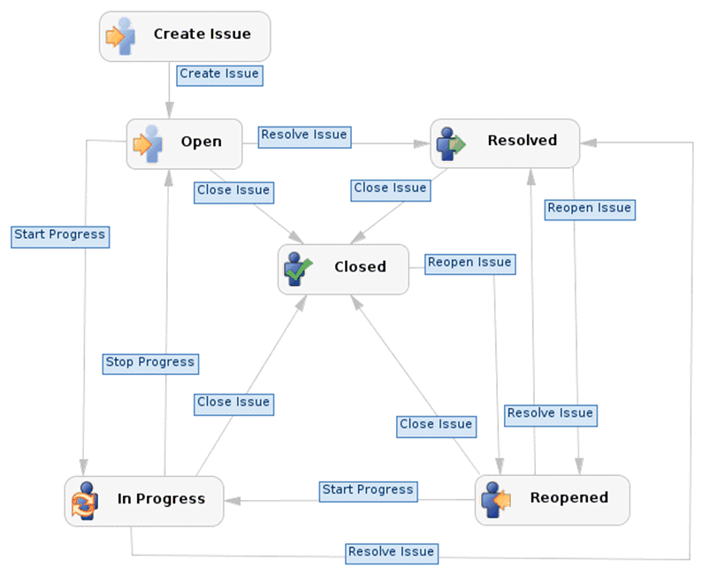

Стандартный жизненный цикл состояний для дефекта выглядит примерно как

- Новый
- Взятый на исправление
- Исправленный
- Закрытый (исправленный и проверенный)

Но в зависимости от ситуации может оказаться так, что жизненный цикл состояний изменится. 
Например, если разработчик ошибся при исправлении дефекта то путь может выглядеть так:

- Новый
- Взятый на исправление
- Исправленный
- Заново открытый
- Взятый на исправление
- Исправленный
- Закрытый (исправленный и проверенный)

---

При этом в течение жизненного цикла дефекта его характеристики могут изменяться, например:

- Переход из одного состояния в другое состояние (как раз описано выше)
- Изменение ответственного за исправление
- Изменение ответственного за проверку
- РЕДКО: изменение автора
- Изменение контекста
- РЕДКО: Изменение серьезности
- Изменение срочности
- РЕДКО: Изменение категории
- Изменение содержания
- Изменение резолюции
- Изменение способа обхода

Права на изменение той или иной характеристики зависят от разных факторов, среди них могут быть:

- Состояния дефекта (например, нельзя перевести дефект из `Новый` сразу в `Заново открытый`)
- Роли сотрудника (например, закрыть дефект может только QA)
- Политики компании

# 32. Системы управления дефектами.

Другие названия:

- Системы отслеживания ошибок
- Системы управления изменениями и дефектами
- Трассировка изменений
- Трассировка ошибок
- Управление инцидентами
- Управление рекламациями
- Bug tracking system
- Issue tracking system
- и т.п.

Для управления дефектами (их характеристиками и жизненным циклом, правами доступа и т.п.) существует специализированное
программное обеспечение - **системы управления дефектами**

Данные системы контролируют жизненный цикл дефекта и предоставляют дополнительные возможности, что упрощают работу
команды разработки ПО.

Примеры:

- Коммерческие
  - IBM Rational ClearQuest
  - Microfocus StarTeam
  - Atlassian JIRA
  - JetBrains YouTrack
  - И другие
- Свободно распространяемые
  - Mozilla Bugzilla
  - Trac
  - Redmine
  - MantisBT
  - TUTOS
  - Интегрированные в серверы хостинга проектов (BitBucket, GitHub и т.п.)
  - И другие

---

Типичный жизненный цикл дефекта в различный системах управления дефектами различаются, но обычно они имеют 5 стандартных стадий:

- Новый (открыт)
- Взят на исправление
- Исправлен
- Закрыт (исправлен и проверен)
- Переоткрыт (например в случае, если такой же дефект воспроизвелся снова, по сути эта стадия совпадает с состоянием `Открыт`)

**ПОСЛЕ КАРТИНОЧЕК ЕЩЕ ИНФА ЕСТЬ, НЕ ЗАБУДЬ**

Типичные жизненные циклы в некоторых СУД:

- `Mozilla Bugzilla`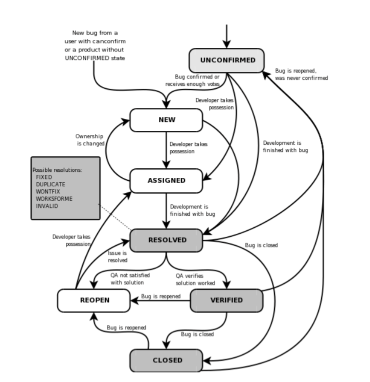
- `Trac` 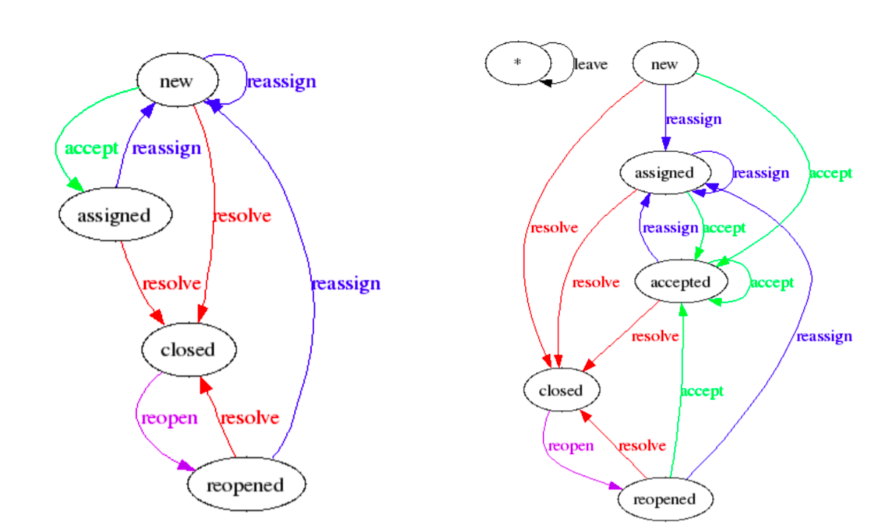
- `Redmine` 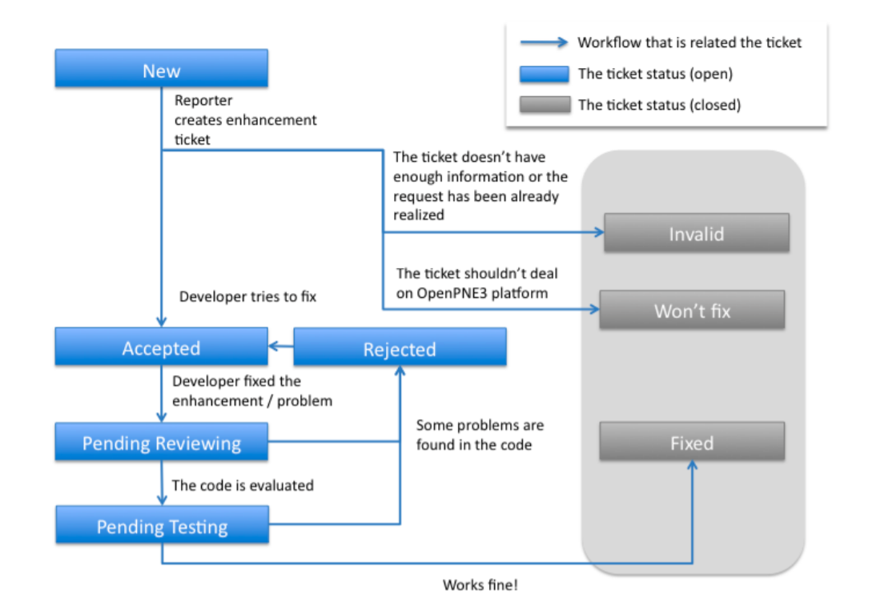
- `Jira` 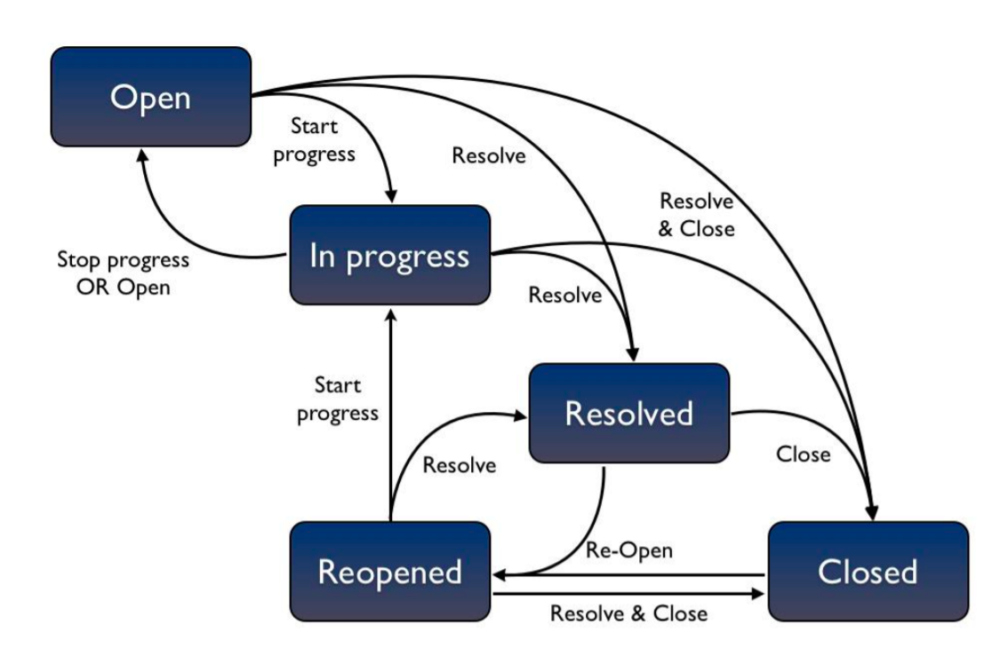
- `Jetbrains YouTrack` 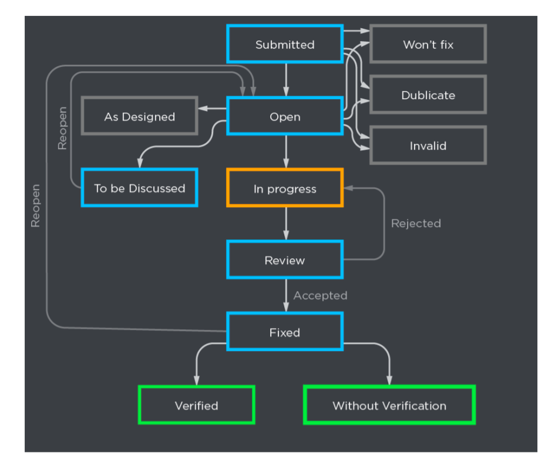

---

Кроме того СУД позволяют отправлять пользователям нотификации при различных обновлениях:

- Появление нового дефекта
- Изменение состояния существующего дефекта
- Изменение характеристик существующего дефекта

Нотификации можно отправлять различными способами:

- Интерактивными
  - SMS
  - Системы обмена мгновенными сообщениями
- Не интерактивными
  - E-mail
  - Через клиент СУД

Дополнительно можно гибко настраивать нотификации, например:

- По отношению к роли
- По отношению к свойствам дефекта
- По отношению к состоянию дефекта
- И другое

---

Ввиду наличия дополнительных возможностей СУД и некоторой схожести характеристик/жизненного цикла задач и дефектов, 
СУД используют не только для отслеживания дефектов, но и для управления задачами. 
Однако следует помнить, что задачи все же имеют свой жизненный цикл

Для визуализации работы и прогресса используются так называемые `agile-доски`, `scrub-доски`, `kanban-доски`, 
которые представляют собой таблицу с карточками

- Столбцы таблицы – важные состояния работ (задач)
- Наполнение столбца – задачи, находящиеся в данном состоянии 
- Место задачи в столбце – приоритет

Данные доски позволяют наглядно визуализировать все типы работ по проекту или этапу проекта и менять приоритеты работ

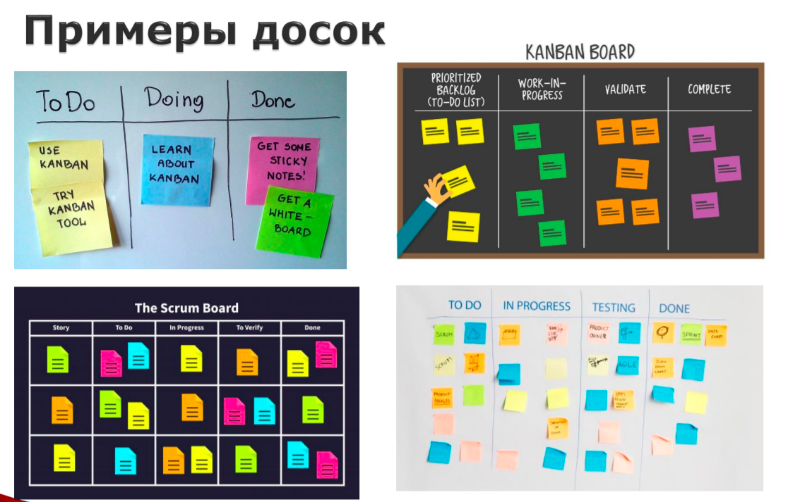

Сервисы, предоставляющие это:

- Trello
- Jira
- JetBrains YouTrack
- И другие

# 33. Системы контроля версий. Типы СКВ. Общие принципы организации. 

Другие названия системы контроля версий:

* Системы управления версиями (VCS - Version
  Control System).
* Системы контроля ревизий (RCS - Revision
  Control System).
* Системы управления исходным кодом (SCM –
  Source Code Management).

**Системы контроля версий** - это специализированные программные инструменты, которые решают задачу
автоматизации групповой работы и управления версионированием проектов.
Изначально только для программных проектов. Но сейчас используются почти во всех областях, где есть 
артефакты, сохраняемые в виде файлов операционной системы и над которыми можно работать. Например, 
проекты по управлению созданием аппаратуры; написание документации, статей, книг и т.д. 
Везде, где есть артефакты, файлы, которые могут версионироваться, отмечаться, удаляться, 
сравниваться и т.д.

## Общие принципы систем контроля версий

Системы контроля версий обеспечивают:

* Репозиторий (или несколько репозиториев) для хранения проектов и их артефактов. 
* Стандартизируют стандартные операции для групповой работы. Т.е вводят операции, необходимые 
  для групповой работы. Обычно таких операций 30-40 в каждой системе контроля версий.
* Предоставляют клиенты для разных операционных систем для выполнения операций. 
  Почти всегда есть текстовый(консольный) клиент для выполнения этих операций. 
  Консольный клиент необходим для автоматизации:
    * автоматизация сборки.
    * continuous integration.
    * continuous delivery.
    * и т.д.

Значит что эти операции выполняются не человеком, а роботом. Соответственно есть два подхода:

* сделать публичный API, которым будет пользоваться система автоматизации.
* использовать консольные приложения с публичным API - аргументы командной строки.

Почему используют командную строку, а не другой публичный API? Так как в случае использования API, 
пришлось бы сделать для всех возможных систем реализацию. В случае с командной строкой, при появлении
новой системы, просто изменяются конфигурационные файлы - названия команд и параметров, которые они принимают, 
интерпретации вывода. Не придётся дописывать модуль интеграции или что-то вроде этого.

Это является стандартом, когда интеграция с разными системами автоматизации может производиться 
через командную строку. В случае работы с API, такого же простого механизма нет.

## Типы систем контроля версий

Условно делят на два типа, у одного из которых есть два подтипа:

* централизованные файл-серверные системы контроля версий. Самые древние. 
  Организованы следующим образом:
    * имеется централизованное хранилище на сервере. 
    * Клиенты обращаются к хранилищу используя файл-серверный доступ. **Файл-серверный доступ** - 
      когда организуем взаимодействие двух приложений через разделяемые файлы.
        Репозиторий, в котором хранятся проекты используется как разделяемый ресурс, а клиенты через 
        средства операционной системы по управлению общими файлами имеют доступ к репозиторию.
        Например: MS Visual Source Safe. Единственные способ работы над файлом - его блокировка.
* Централизованные системы контроля версий. Организованы следующим образом:
  * имеется единое централизованное хранилище на сервере.
  * клиент-серверный доступ. Клиенты у пользователей, по специальному протоколу обращаются к серверу,
    где расположен репозиторий и операции осуществляются через серверное ПО и через клиентов.
    Например: CVS, Subversion.
* Распределённые системы контроля версий:
  * есть множество репозиториев. Есть центральный репозиторий + каждый компьютер является маленьким 
    репозиторием.
  * обмен информацией между отдельными репозиториями реализуется через специальные механизмы слияний
    (заплаток, патчей, change sets и т.п).
  * Используется в интернет-проектах, когда разработчики существенно удалены друг от друга.
    Например: mercurial, git, Bazaar и т.п.

Файл-серверные системы практически не встретить. Централизованные системы постепенно отдают 
пространство распределённым. 

Пример, когда нельзя работать в централизованной системе - система идеальна только при условии,
что у всех участников проекта есть интернет. Однако существует множество мест, где интернета нет, 
либо доступ периодами, либо слишком плохой. Ответ: когда необходимо продолжать вести разработку 
в местах где нет интернета.

Минусы распределённой системы контроля версий:

* много сущностей - больше репозиториев.
* большое количество ежедневных операций, по сравнению с централизованной системой контроля версий.

Относительное преимущество централизованной системы контроля версий - всегда есть репозиторий, в котором есть 
последняя версия проекта. В распределённых системах у каждого разработчика может быть разная версия проекта, в зависимости 
от того успел разработчик слить изменения или нет, сложно точно определить, где последняя версия.

### Ревизия файла

Все файлы и артефакты, которые хранятся в системе контроля версий имеют уникальный идентификатор - 
ревизия файла. Примеры:

* CVS: 1.2.
* SVN: 238.
* Git, Mercurial: хэш SHA-1.

При любом изменении файла изменяется также и номер ревизии файла, по определённому правилу: 
например в системе SVN инкрементируется, в системе CVS инкрементируется последня значащая цифра,
когда требуется ревизия всего репозитория, то изменяется атрибут всего репозитория. 

У ревизий есть разные атрибуты: 

* идентификатор.
* автор, кто сделал данную ревизию.
* дата.
* текстовое описание, почему эта ревизия появилась
* внешние атрибуты:
  * теги 
  * идентификаторы ветвей

Для централизованных систем контроля версий может быть несколько состояний в которых находится проект:

* локальная копия проекта, которая ещё не влита в репозиторий.
* локальная копия проекта, но под системой контроля версий, в таком случае добавляются скрытые файлы с мета информацией.
* серверная копия репозитория

Для распределённых систем контроля версий существуют следующие состояния: 

* локальная копия проекта.
* локальная копия проекта, под контролем системы контроля версий.
* копия находящаяся в локальном репозитории.
* копия находящаяся в удалённом репозитории.

### Общие принципы хранения файлов в системах версионирования.

* Поддержка текстового и бинарного формата. Текстовый формат чаще всего нужен для 
  представления исходного кода артефактов. В текстовом формате реализуются следующие функции:

    * хранение инкрементальных изменений. Хранится первая версия и "дельты" относительно первой версии.
    * возможность визуального сравнения ревизий

     Для бинарного формата следующие функции:

    * хранение полных версий артефакта. Например, полная версия картинки, документации.
    * функции сравнения не предусмотрено.

    Хранение бинарных версий артефакта необходимо делать только в случае острой необходимости.

* Пометка версий в системе контроля версий, используются следующие способы пометки:

  * теги
  * именованные виртуальные каталоги 

  Пометка тегами - специализированными текстовыми метками, которые привязываются к какой-либо 
  ревизии файла или репозитория. Для тега важно быть неизменяемым для гарантии целостности.

  * одна ревизия может содержать несколько тегов.
  * Выборку ревизии файла/файлов можно производить по тегам.

  Именованные виртуальные каталоги:

  * Вместо тега создается каталог.
  * В него помещаются виртуальные копии необходимых ревизий всех требуемых файлов
  * Работа с таким каталогом происходит стандартными способами
  * необходимо гарантировать неизменяемость файлов внутри каталога

# 34. Системы контроля версий. Типовые операции.

* Импорт проекта (import).
* Экспорт проекта (export).
* Получение проекта (checkout, clone, …).
* Обновление файла (update, fetch, ..).
* Фиксация изменений (commit).
* Сравнение изменений.
* Установка тегов.
* Переход к другой ревизии (откат).
* Создание ветвей (fork,…).
* Переключение на ветвь.
* Слияние (merge).
* Разрешение конфликтов.
* Блокировка файлов.
* Выгрузка изменений (push).
* Запрос на изменение (pull request).

Импорт - первоначальное помещение локального проекта в репозиторий.

Экспорт - редкая операция, окончание разработки проекта, состоит из двух шагов:

* Извлечение проекта из системы контроля версий в локальный каталог.
* Удаление проекта из системы контроля версий.

Получение копии проекта: 

* Получение локального слепка проекта
* Получение осуществляется по одному из критериев:
  * Головная версия (HEAD, trunk, default, master, …).
  * Версия на определенную дату.
  * Версия с определенным тегом.
  * Версия из определенной ветви.

Фиксация изменений:

* Посылка измененной версии файла в репозиторий
* Операция игнорируется, если ревизия на сервере изменилась

Обновление файлов:

* Копирование свежей версии из репозитория
* Слияние локальных изменений и серверных в локальном файле

Разрешение конфликтов

Конфликт - изменений одной и той же строки в двух версиях.

* Если при слиянии произошел конфликт – в текст попадают обе версии участков кода с пометками.
* Разрешение проводится только в локальной копии.
* В репозитории хранятся только утвержденные версии с разрешенным конфликтом.

Сравнение изменений:

* Действует только для текстовых файлов.
* Сравнивать можно любые две ревизии одного файла из любых ветвей проекта.

# 35. Сборка программных проектов. Проблемы при сборке программных проектов

**Сборка** — набор правил и процедур, направленный на получение исполняемой программы

**Выпуск** — процесс отчуждения программы от разработчика и заключающийся в

- Сборке программного проекта
- Формировании
  - инсталляционного пакета
  - документации
  - аннотации релиза

### Задачи сборки и выпуска проектов

- Компиляция всего проекта
- Сборка дистрибутива
- Подготовка исходных текстов (для того чтобы передать его заказчику без ненужных артефактов)
- Подготовка документации

**Процесс сборки** — из одного набора артефактов получается другой набор артефактов

**Исходные артефакты**

- Исходные файлы
- Подключаемые файлы (*.h*) 
- Библиотеки
- Процедура сборки (некий процесс описанный в виде скрипта последовательность сборки)
- Инструменты сборки (компиляторы, линкеры)

На выходе получаем готовый артефакт (*.exe* *.jar* *.pdf*)

### Проблемы сборки

- **с исходными текстами**
  - отсутствие всех исходных текстов
  - некорректное расположение исходных текстов
  - **неправильные версии исходных файлов** (опасно тем, что проект может собраться, но не будет корректно работать)
- **с подключаемыми файлами**
  - Отсутствие подключаемых файлов
  - Неправильное расположение подключаемых файлов
  - Некорректные версии подключаемых файлов
- **с используемыми библиотеками**
  - Отсутствие библиотек
  - Неправильное расположение 
  - Некорректные версии 
- **с процедурами сборки**
  - Отсутствие процедуры сборки проекта
  - Отсутствие процедур сборки компонентов проекта
  - Несоответствие версии процедуры сборки
- **со средствами (утилитами) сборки** — компиляторы, линкеры, генераторы
  - Неполный состав средств сборки
  - Некорректные версии средств сборки
- **с системной средой и аппаратной платформой сборки**
  - Неправильная версия ОС
  - Неправильные версии компонентов ОС
  - Некорректный состав аппаратуры (слишком мало ядер процессора)
  - Некорректные параметры аппаратуры (слишком мало оперативной памяти)

# 36. Сборка программных проектов. Окружение для сборки. Общие требования к системе сборки.
### Окружение для сборки

- Аппаратная платформа
- Системное окружение
- Библиотечное окружение
- Исходные файлы в требуемых каталогах
- Средства сборки 

### Построение окружения 

- Установка всех требуемых библиотек
- Установка всех средств сборки
- Размещение всех исходных файлов (можно взять из системы контроля версий, но если хотим отдать код заказчику, то он будет брать код из архива)

### Требования к системе сборки

- Должна проводиться на любом компьютере с подготовленным окружением
- Должна проводиться отдельно от разработчика
- **Процедура сборки должна быть:**
  - Документирована
  - Прозрачна
  - Повторяема
- Процедуры сборки должны 
  - находиться под управлением системы контроля версий
  - помечаться и ветвиться аналогично файлам проекта
    изменяться в соответствии с изменениями проекта

Сборку проводят с использованием средств виртуализации, для того чтобы не замусоривать файлами сборки систему и они не мешали последующим сборкам. 

### Сборка отдельных компонентов проекта 

1. Для каждого компонента проекта должна быть процедура сборки (*makefile*)
2. Для каждого компонента сборка должна проходить **одной командой** (чтобы поддерживать рекурсивные сборки)

# 37. Непрерывная интеграция

**Интеграция ПО** - процесс объединения частей ПО (вновь добавленных или измененных) в основное ПО с целью получения работоспособной версии

**Непрерывная интеграция** (continuous integration, CI) - один из процессов ПИ, предполагающий периодическую (частую) интеграцию отдельных частей проекта

## Зачем

Каждый раз, когда добавляем какую-то функциональность, хотим прежде убедиться, что эта добавленная функциональность:

- Не мешает сборке проекта (проект собирается)
- Сохраняет проект в работоспособном состоянии (проект проходит некую автоматизированную процедуру проверки качества - чаще всего, тесты)

При этом предполагается, что этот процесс выполняется _автоматически_. Из-за этого возникают определённые требования к непрерывно интегрируемым проектам.

## Требования к проектам

- Все компоненты должны находиться в Системе Контроля Версий
- Полностью автоматизированная процедура сборки проекта
- Полностью автоматизированная процедура тестирования проекта. Этот пункт зачастую оказывается наиболее проблемным, т.к. далеко не любой проект можно хорошо протестировать автоматически - например, приложения с графическим UI, с видео контентом, с вероятностным результатом (система распознавания лиц)

## Чего мы ожидаем от системы CI

- Работает независимо от программиста - процесс проверок запускается автоматически по определённым событиям
- Возможность отследить, что произошло и когда (отчётность), в какой момент и какой конкретно компонент вызвал ошибку

Исходя из этого, система CI должна выполнять определённые действия.

## Действия в системах CI по порядку

1. Инкремент текущего номера сборки («билда»)
2. Пометка текущим номером сборки файлов собираемого проекта
3. Получение проекта (помеченного тегом) из репозитория - обычно в специализированную виртуальную машину с
   подготовленным окружением
4. Сборка проекта
5. Запуск тестирования (и/или [других процедур обеспечения качества](#Процедуры-обеспечения-качества-*))
6. Развертывание проекта
7. Формирование отчёта

## Условия запуска

### По расписанию

- Днём пишем код, ночью происходит его проверка
- Запуск **полного** набора тестов (может занимать до нескольких часов)

### По обновлению файлов репозитория

- Цель - определить, что конкретное обновление не испортило систему
- Запуск производится после каждого обновления в репозитории проекта
- Запускается сокращенная процедура сборки и тестирования (смок-тестирование: тесты делятся на более и менее важные)
  - Длительность 5-15 минут
  - При большей длительности интеграция бессмысленна

### По запросу

- Есть абстрактная кнопка "запустить CI", нажали - процесс пошёл

## Промышленные средства CI

- Apache Gump
- Atlassian Bamboo
- CruiseControl
- Jenkins
- BuildBot
- Travis CI
- MS Team Foundation Server
- JetBrains TeamCity
- ... (более 20 средств)

## Процедуры обеспечения качества *

**Лирическое отступление, рассказывать, если спросит!**

Примеры:

- Тесты
- [Статический анализ](https://ru.wikipedia.org/wiki/%D0%A1%D1%82%D0%B0%D1%82%D0%B8%D1%87%D0%B5%D1%81%D0%BA%D0%B8%D0%B9_%D0%B0%D0%BD%D0%B0%D0%BB%D0%B8%D0%B7_%D0%BA%D0%BE%D0%B4%D0%B0). TLDR - то, что происходит, когда IDE подчёркивает куски кода красным / жёлтым: проверка правильности написания без фактического выполнения
- [Фаззинг](https://ru.wikipedia.org/wiki/%D0%A4%D0%B0%D0%B7%D0%B7%D0%B8%D0%BD%D0%B3). TLDR - пихаем на вход рандомно генерированный бред, заведомо неверные данные и т.д., и проверяем, что система не падает
- ...

Свойства:

- Полнота: процедура находит **все** баги в системе
- Точность: нет false positives - если мы нашли баг, то это **точно** баг

Для CI подходят те методики, у которых обязательно соблюдается свойство точности, но не обязательно - свойство полноты. Из перечисленных примеров это тестирование и фаззинг (но фаззинг может оказаться слишком долгим).

# 38. Непрерывная доставка. Непрерывное развёртывание.

**CD** - Continuous Delivery (Доставка), Continuous Deployment (Развёртывание). **Важно**: это не разные способы обозначить
одно и то же, а **два разных термина**, которые, так уж случилось, имеют одинаковую аббревиатуру.

В общем и целом, CI, C/Delivery и C/Deployment - это о разной степени автоматизации процесса проектирования.

## Непрерывная доставка

Этапы CI:

1. Получение ПО из репозитория
2. Автоматическая сборка ПО
3. Запуск автоматических тестов

Этапы, специфичные для C/Delivery:

4. Развертывание на тестовом сервере
5. Дополнительное тестирование (автоматическое и силами QA)
6. Размещение обновления на публичном сервере
7. **Ручное** принятие решения о развертывании обновления на продуктовом сервере
8. Автоматическое развертывание на продуктовом сервере

Пример:

Магазин приложений (i.e., Google Play). Разработчик обновил приложение, выложил в магазин, а далее пользователь сам принимает решение о том, хочет ли он обновлять приложение или нет (в данном случае "продуктовым сервером" является устройство пользователя - телефон, планшет etc.)

## Непрерывное развёртывание

Этапы:

Пункты 1-6 совпадают с C/Delivery. Далее сразу происходит **автоматическое** развёртывание на продуктовом сервере.

Пример:

Обновления ВК. Пользователь не принимает решения, хочет ли он переименовать "Сообщения" в "Мессенджер", хочет ли и дальше не знать о существовании клипов, хочет ли переходить на новую систему реакций на посты.

# 39. Качество программного обеспечения. Стандарты качества.

### Стандарты качества ПО

- Международные стандарты
  - ISO/IEC 9126. Software engineering - Product quality
  - ISO/IEC 25010:2011. "Systems and software engineering - Systems and software Quality Requirements and Evaluation (SQuaRE) - System and software quality models"
- Российские стандарты
  - ГОСТ 28195-89 «Оценка качества программных средств»
  - ГОСТ Р ИСО/МЭК 9126-93 «Оценка программной продукции»
  - ГОСТ Р ИСО/МЭК 25010-2015 Информационные технологии (ИТ). Системная и программная инженерия. Требования и оценка качества систем и программного обеспечения (SQuaRE). Модели качества систем и программных продуктов

#### ГОСТ Р ИСО/МЭК 9126 (ISO 9126)

**Качество ПО** - весь объем признаков и характеристик программной продукции, который относится к её способности удовлетворять установленным и предполагаемым свойствам

**Характеристики качества** – набор свойств программной продукции, по которым её качество описывается и оценивается

#### Характеристики качества по ISO 9126
- Функциональность (Functionality)
- Надежность (Reliability)
- Практичность (Usability)
- Эффективность (Efficiences)
- Сопровождаемость (Maintainability)
- Мобильность (Portability)

**Качество системы** - это степень удовлетворения системой заявленных и подразумеваемых потребностей различных заинтересованных сторон

# 40. Характеристики качества по стандарту ГОСТ Р ИСО/МЭК 25010-2015. Функциональность. Надежность.

### Функциональность.

**Функциональная пригодность** - степень, в которой продукт или система обеспечивают выполнение функции в соответствии с заявленными и подразумеваемыми потребностями при использовании в указанных условиях.

**Подхарактеристики**
- Функциональная полнота (functional completeness): степень покрытия совокупностью функций всех определенных задач и целей пользователя
- Функциональная корректность (functional correctness): степень обеспечения продуктом или системой необходимой степени точности корректных результатов.

### Надежность.
**Надежность** - степень выполнения системой, продуктом или компонентом определенных функций при указанных условиях в течение установленного периода времени.

**Подхарактеристики**
- Завершенность (maturity): степень соответствия системы, продукта или компонента при нормальной работе требованиям надежности.
- Готовность (availability): степень работоспособности и доступности системы, продукта или компонента
- Отказоустойчивость (fault tolerance): способность системы, продукта или компонента работать как предназначено, несмотря на наличие дефектов программного обеспечения или аппаратных средств.
- Восстанавливаемость (recoverability): способность продукта или системы восстановить данные и требуемое состояние системы в случае прерывания или сбоя.

# 41. Характеристики качества по стандарту ГОСТ Р ИСО/МЭК 25010-2015. Уровень производительности. Удобство использования. Защищенность

### Уровень производительности.

**Уровень производительности** - производительность относительно суммы использованных при определенных условиях ресурсов.

**Подхарактеристики**
- Временные характеристики (time behaviour): степень соответствия требованиям по времени отклика, времени обработки и показателей пропускной способности продукта или системы.
- Использование ресурсов (resource utilization): степень удовлетворения требований по потреблению объемов и видов ресурсов продуктом или системой при выполнении их функций.
- Потенциальные возможности (capacity): степень соответствия требованиям предельных значений параметров продукта или системы.

### Удобство использования.

**Удобство использования** - степень, в которой продукт или система могут быть использованы определенными пользователями для достижения конкретных целей с эффективностью, результативностью и удовлетворенностью в заданном контексте использования.

**Подхарактеристики**
- Определимость пригодности (appropriateness recognizability): возможность пользователей понять, подходит ли продукт или система для их потребностей, сравним ли с функциональной целесообразностью
- Изучаемость (learnability): возможность использования продукта или системы определенными пользователями для достижения конкретных целей обучения для эксплуатации продукта или системы с эффективностью, результативностью, свободой от риска и в соответствии с требованиями в указанном контексте использования.
- Управляемость (operability): наличие в продукте или системе атрибутов, обеспечивающих простое управление и контроль.
- Защищенность от ошибки пользователя (user error protection): уровень системной защиты пользователей от ошибок.
- Эстетика пользовательского интерфейса (user interface aesthetics): степень "приятности" и "удовлетворенности" пользователя интерфейсом взаимодействия с пользователем.
- Доступность (accessibility): возможность использования продукта или системы для достижения определенной цели в указанном контексте использования широким кругом людей с самыми разными возможностями.

### Защищенность.

**Защищенность** - степень защищенности информации и данных, обеспечиваемая продуктом или системой путем ограничения доступа людей, других продуктов или систем к данным в соответствии с типами и уровнями авторизации.

**Подхарактеристики**
- Конфиденциальность(confidentiality):обеспечение продуктом или системой ограничения доступа к данным только для тех, кому доступ разрешен.
- Целостность(integrity):степень предотвращения системой, продуктом или компонентом несанкционированного доступа или модификации компьютерных программ или данных.
- Неподдельность (non-repudiation): степень, с которой может быть доказан факт события или действия таким образом, что этот факт не может быть отвергнут когда-либо позже.
- Отслеживаемость(accountability):степень, до которой действия объекта могут быть прослежены однозначно.
- Подлинность (authenticity): степень достоверности тождественности объекта или ресурса требуемому объекту или ресурсу.

# 42. Характеристики качества по стандарту ГОСТ Р ИСО/МЭК 25010-2015. Совместимость. Сопровождаемость. Переносимость. 

### Совместимость.

**Совместимость** - способность обмениваться информацией с другими продуктами, системами или компонентами, и/или выполнять требуемые функции при совместном использовании одних и тех же аппаратных средств или программной среды.

**Подхарактеристики**
- Сосуществование (совместимость) (co-existence): способность продукта совместно функционировать с другими независимыми продуктами в общей среде с разделением общих ресурсов и без отрицательного влияния на любой другой продукт.
- Функциональная совместимость (интероперабельность) (interoperability): способность двух или более систем, продуктов или компонент обмениваться информацией и использовать такую информацию.

### Сопровождаемость.

**Сопровождаемость** - результативность и эффективность, с которыми продукт или система могут быть модифицированы предполагаемыми специалистами по обслуживанию.

**Подхарактеристики**
- Модульность (modularity): степень представления системы или компьютерной программы в виде отдельных блоков таким образом, чтобы изменение одного компонента оказывало минимальное воздействие на другие компоненты
- Возможность многократного использования (reusability): степень, в которой актив может быть использован в нескольких системах или в создании других активов.
- Анализируемость (analysability): степень простоты оценки влияния изменений одной или более частей на продукт или систему или простоты диагностики продукта для выявления недостатков и причин отказов, или простоты идентификации частей, подлежащих изменению.
- Модифицируемость (modifiabiIity): степень простоты эффективного и рационального изменения продукта или системы без добавления дефектов и снижения качества продукта.
- Тестируемость (testability): степень простоты эффективного и рационального определения для системы, продукта или компонента критериев тестирования, а также простоты выполнения тестирования с целью определения соответствия этим критериям.

### Переносимость.

**Переносимость** - степень простоты эффективного и рационального переноса системы, продукта или компонента из одной среды (аппаратных средств, программного обеспечения, операционных условий или условий использования) в другую.

**Подхарактеристики**
- Адаптируемость (adaptability): степень простоты эффективной и рациональной адаптации для отличающихся или усовершенствованных аппаратных средств, программного обеспечения, других операционных сред или условий использования.
- Устанавливаемость (installability): степень простоты эффективной и рациональной, успешной установки и/или удаления продукта или системы в заданной среде.
- Взаимозаменяемость (replaceability): способность продукта заменить другой конкретный программный продукт для достижения тех же целей в тех же условиях.

# 43. Методы обеспечения качества ПО. Классификация. 

### Терминология

**Верификация** - подтверждение на основе представления объективных свидетельств того, что установленные требования были выполнены

**Валидация** - подтверждение на основе представления объективных свидетельств того, что требования, предназначенные для конкретного использования или применения, выполнены, декларируемые свойства и характеристики подтверждаются, а поставленная цель (предназначение системы, комплекса, устройства и т. д.) достигнута.

### Классификация
- По используемым формализмам
  - Формальные методы
  - Неформальные методы
- По необходимости запуска анализируемой программы
  - Динамические 
    - Тестирование - проверка того, что на конкретных исходных данных программа выдает необходимый результат 
    - Фаззинг - вид тестирования, при котором программу пытаются вывести из строя с помощью подачи на вход случайных данных 
    - Профилирование - метод динамического расчета характеристик производительности программ:
      - Анализ утилизации ресурсов 
      - Вычисление временных параметров выполнения программы или ее частей
    - Мониторинг - проверка свойств программы извне во время их исполнения с помощью специализированных контролирующих программ
    - Проверка контрольных точек программы 
      - Проверки утверждений (assertion)
      - Динамическая проверка контрактов
  - Статические 
    - Формальная верификация 
      - Подтверждение, что программа соответствует спецификации
      - Проверка, что определенные свойства в программе выполняются 
      - Методы: 
        - Дедуктивная верификация 
        - Model checking (методы проверки модели)
    - Статический анализ 
      - Анализ различных программных артефактов (исходный код, модели, контракты, комментарии и т.п.)
      - Обнаружение определенного класса ошибок в программе или мест, в которых может быть ошибка
    - Аудит (code review)
      - Ручной или автоматизированный метод проверки качества программного кода 
    - Трансформации программ 
      - Рефакторинг 
      - Оптимизация 
      - Автоматическая модификация кода 
      - Деобфускация кода
  - Смешанные
    - Анализ трасс исполнения 
      - Инструментирование программы 
      - Сбор данных о состоянии программы (в динамике) 
      - Анализ корректности собранной информации (в статике)
    - Синтез тестов + тестирование 
      - Статический синтез тестов 
      - Запуск синтезированных тестов
- По уровню автоматизации
  - Ручные 
  - Автоматизированные 
  - Автоматические

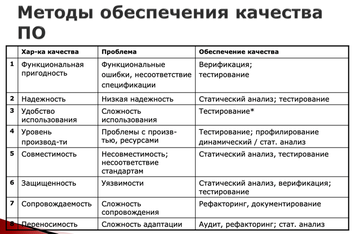

# 44. Лицензированное ПО. Классификация ПО 
### Классификация ПО
- По отношению к собственности
  - Проприетарное ПО
    - Является собственностью авторов или правообладателей
    - Не удовлетворяет критериям свободного ПО
  - Свободное ПО
    - Права пользователя по свободной установке, запуску, использованию, изучению, распространению и модификации защищены юридически с помощью свободных лицензий
    - Ричард Столлман. 4 свободы ПО:
      - свобода запуска с любой целью
      - свобода запуска с любой целью
      - свобода изучения работы программы и адаптация её к своим целям
      - свобода улучшения программы и публикации улучшений, так что всё общество выиграет от этого
- По отношению к извлекаемой прибыли
  - Коммерческое ПО
    - создано с целью получения прибыли
  - Бесплатное ПО
    - лицензионное соглашение не требует каких-либо выплат правообладателю
- По доступности исходных кодов
  - Открытое ПО
    - Исходные коды доступны в комплекте поставки
    - Исходные коды доступны по запросу
  - ПО с закрытыми исходными кодами

# 45. Лицензированное ПО. Лицензия GPL

### Лицензия GPL (General Public License)
- Первая версия GPLv1 или просто GPL – 1989 год
- Вторая версия GPLv2 – 1991 год
- Третья версия GPLv3 – 2007 год
- Основная цель – предоставить пользователю права по отношению к ПО:
  - Копирование
  - Модификация
  - Распространение (в том числе коммерческое)
- Принцип «наследования прав» Copyleft
- Распространитель ПО на условиях GPL обязан предоставить получателю возможность доступа к исходным кодам

### Регламентирует
  - Право на копирование и распространение
  - Право на изменение
  - Предоставление исходного кода
    - Распространение вместе с исходным кодом
    - Гарантия выдачи исходного по требованию
    - Включение таких гарантий в поставку
  - Запрет дополнительных ограничений при дальнейшем распространении
  - Превалирование над внешними ограничениями
  - Прекращение действия лицензии при нарушении её условий

### GPLv2
  - Принята в 1991 году
  - Дополнительно к GPLv1
    - «Свобода или Смерть» - превалирование над внешними ограничениями. Если нельзя выполнить все условия GPLv2, то распространять вообще нельзя
### GPLv3
  - Принята в 2007 году
  - Дополнительно к GPLv2
    - защищает пользователей от судебных претензий при обходе технических средств защиты
    - запрещает тивоизацию: ограничение аппаратного обеспечения на изменение ПО

# 46. Лицензированное ПО. Лицензия LGPL
### Лицензия LGPL (Lesser General Public License)
- Стандартная общественная лицензия ограниченного применения GNU
- Является компромиссом между GPL и лицензиями типа BSD, MIT и т.п.
- Представлена в 1991 году (LGPL v2)
- Действующая версия – 2007 год
- Используется в основном для библиотек
- Регламентирует линковку библиотек с другим ПО, распространяемым по другим лицензиям

### Регламентирует:
  - Возможность линковки данной библиотеки с другим ПО, распространяемым по другой лицензией (не обязательно свободной)
  - Права copyleft на библиотеку, но не накладывает ограничений на линкуемое ПО
  - Необходимость наличия механизмов использования последней версии библиотеки, распространяемой под LGPL
    - Неявный намек на динамическое связывание

# 47. Лицензированное ПО. Лицензии Apache, MIT, Mozilla, BSD 

### Apache License
  - Лицензия на свободное программное обеспечение Apache Software Foundation
  - Версия 2.0 опубликована в 2004
  - Является лицензией на открытое ПО
  - Несовместима с GPLv2
  - Совместима с GPLv3 (в одну сторону)
  - Позволяет объединяться с кодом, распространяемым под другой лицензией
  - Не является copyleft-лицензией - в поставляемом ПО лицензия может изменяться
  - Единственное условие - информирование о факте использования исходного кода, лицензированного под лицензией Apache
  - Получатель не получает все права, изначально предоставляемые лицензией Apache

### Mozilla License
  - Разработана Mozilla Foundation
  - Действующая версия – 2.0, опубликована 3.01.2012
  - Используется в основном продуктами Mozilla
  - Обеспечивает «слабый» copyleft
  - Допускает объединение с проприетарными продуктами
  - Рекомендуется использовать совместно с другими лицензиями

### MIT License
  - Разработана Массачусетским технологическим институтом
  - Опубликована в 1988 году
  - Разрешительная лицензия - позволяет использовать лицензируемый код в закрытом ПО при условии, что текст лицензии предоставляется вместе с этим ПО.
  - Не является copyleft-лицензией
  - Совместима с GPL
  - 
### BSD License
  - Berkley Software Distribution license (BSD license) — программная лицензия университета Беркли
  - Опубликована в 1983 году
  - Является лицензией на открытое ПО
  - Совместима с GPL
  - Код может изменяться без ограничений
  - Не обеспечивает copyleft
  - Позволяет объединяться с кодом, распространяемым под другой лицензией
  - Допускает проприетарное и коммерческое использование ПО
    - Пример – использование компонентов стека TCP/IP (bsd sockets) в MS Windows

